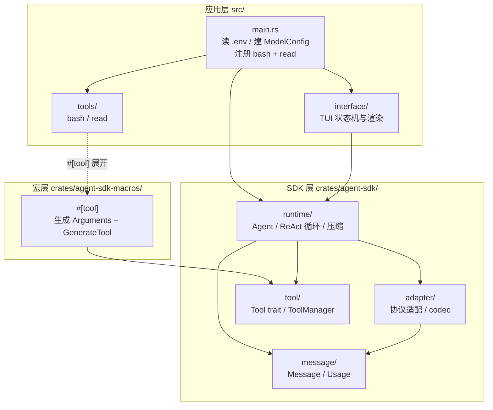
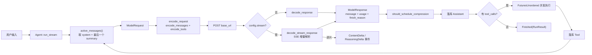
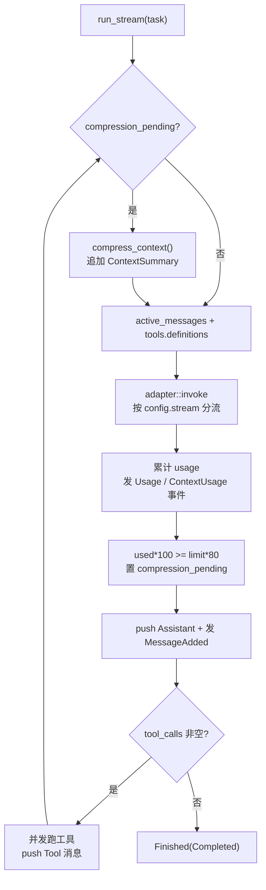
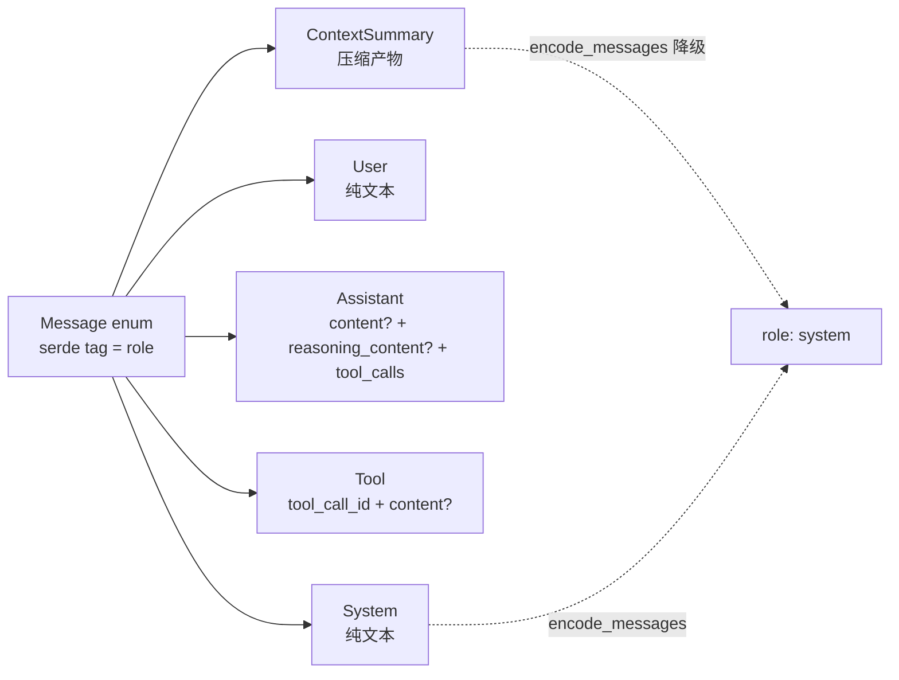
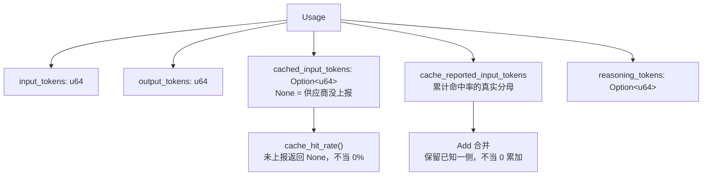
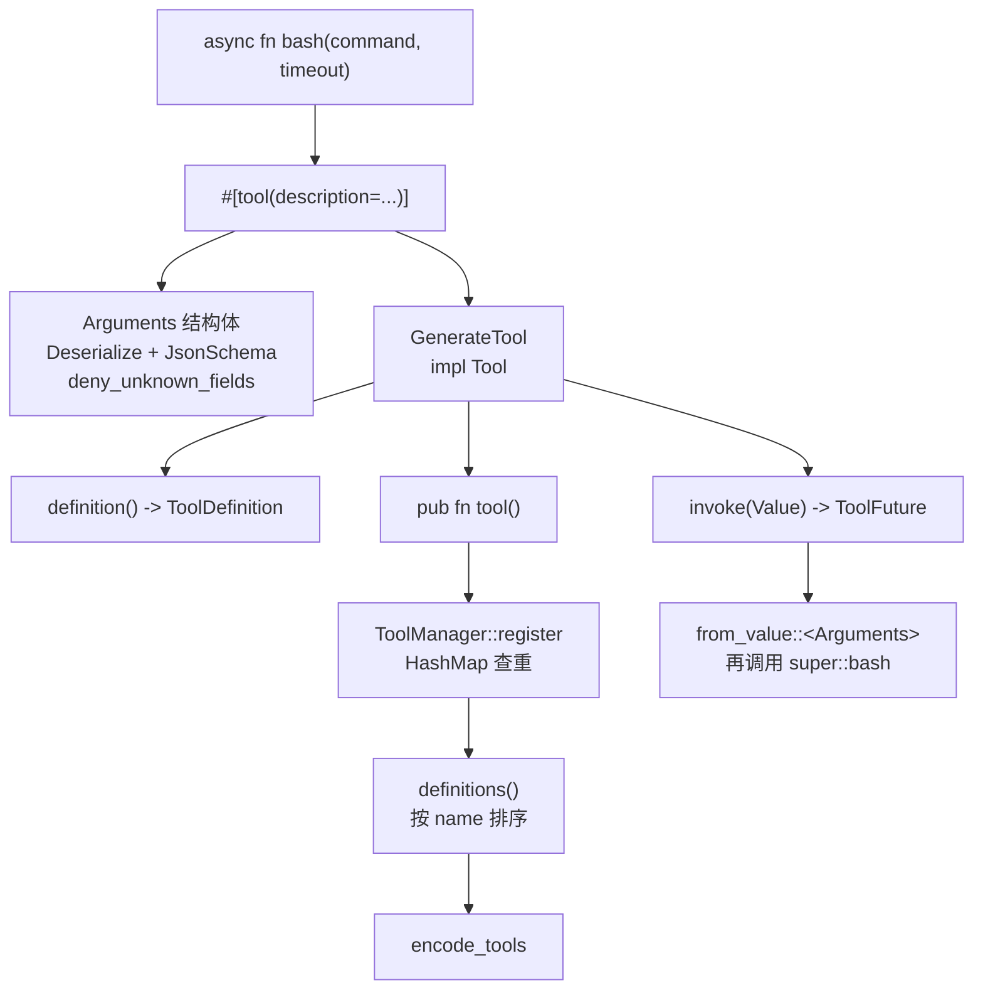
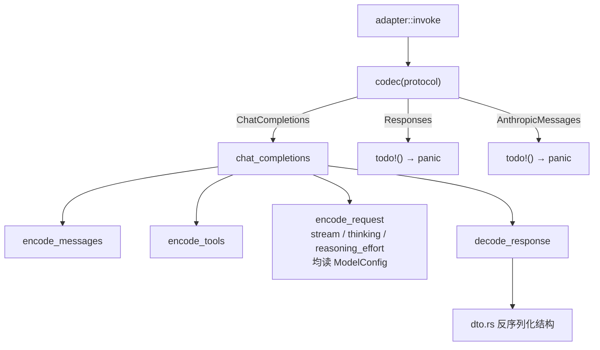
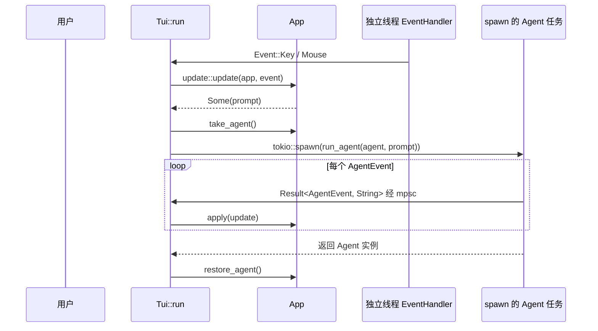
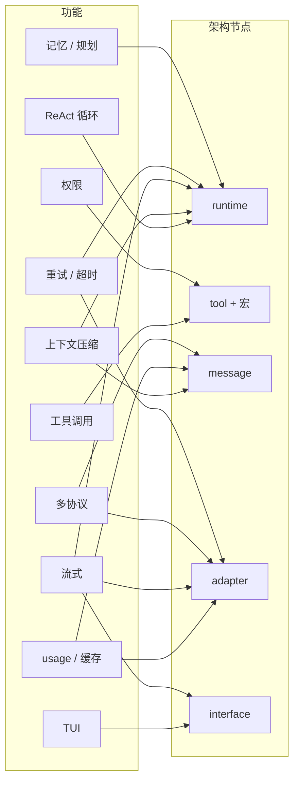

**Shirley 技术方案 · 架构图与功能落点**

这份文档回答两个问题：项目是怎么分层的（结构），以及每个功能长在哪一层、动它要改哪些文件（落点）。配套的设计细节在 `roadmap.md` 引用的各专题文档里。

**图例（适用于下文全部 mermaid 图）**

- **有向图**（`graph TD` / `flowchart LR`）：方框 `[...]` 表示模块 / 组件 / 步骤；实线箭头 `-->` 表示「依赖 / 调用 / 数据流向」；虚线箭头 `-.->`（可带 `|"标签"|`）表示间接关系（如宏展开）或「全程并行、不阻塞」。
- **判断节点**：菱形 `{...}` 配 `A -->|"是/否"| B` 表示条件分支，按标签分流。
- **分组**（`subgraph X["..."] ... end`）：用虚线框把同层 / 同类节点圈在一起（如应用层 / SDK 层 / 宏层、功能 / 架构节点）。
- **时序图**（`sequenceDiagram`）：`participant` 是参与者，`->>` 是请求 / 调用、`-->>` 是返回，`loop … end` 表示循环块。

> 下文共 9 张图：一（分层）、二（单次请求数据流）、三（ReAct 主循环）、四（消息模型 + Usage 语义）、五（工具从函数到可调用）、六（适配层 codec 现状）、七（TUI 事件流）、九（功能↔架构节点依赖）。

**一、三层结构总览**

**边界规则**（`docs/README.md` 里的原则一）：`main.rs` 是唯一做装配的地方；`interface` 只消费 SDK 的公开类型；`tools` 只依赖宏和 `ToolError`，不碰 runtime。SDK 对外只暴露 `lib.rs` 里 re-export 的那些名字，`message` / `adapter` / `runtime` / `tool` 都是私有模块。

**二、一次请求的完整数据流**

对应 `runtime/mod.rs` 的主循环，`adapter/mod.rs` 的 `invoke` 是流式/非流式的分叉点（`config.stream`）。注意 `finish_reason` 虽然被解码出来，但**运行时仍然没有消费它**——`is_finished` 只看 `tool_calls.is_empty()`，所以 `length` 截断会被当成正常完成（见 `runtime-hardening.md` 第三节）。

**三、ReAct 主循环（含压缩）**

**这里的三个薄弱点**（`runtime-hardening.md` 详述）：

1. 循环没有步数上限，`MaxStepsReached` / `Cancelled` 定义了但无人产生（`Completed` 是唯一会产生的值）。
2. `compress_context` 失败会 `Err` 中断整个 stream，是单点故障。
3. `compress_context` 内也走 `adapter::invoke`，它和主循环共用同一个错误通道。

**四、消息模型**

`Usage` 是同一层里语义最微妙的部分：

这两条规则是刻意设计，`testing.md` 里专门列了守护它们的单测。

**五、工具系统：从函数到可调用**

宏的硬约束（`Agent.md` 记的坑）：函数不能有 `self`、参数不能解构、每个参数必须写 `#[param(description)]`、被修饰的函数与生成的 `mod` 必须同层（因为 `invoke` 里调的是 `super::#name`）。

`definitions()` 里那句 `sort_by(name)` **不能删**——它保证工具定义顺序稳定，是 prefix 缓存命中的前提。

**六、适配层：codec 的现状**

两个未接线的配置也在这层：`ModelConfig.request_timeout` 从未被使用，`ModelConfig` 的 `temperature` / `max_output_tokens` 没有进入请求体。`stream` / `thinking` / `reasoning_effort` 已经改为读 `ModelConfig`（不再是硬编码）。`encode_messages` 写在适配层这件事，代码里自己的注释都承认"该在 message 侧"（见 `adapter-layer.md`）。

**七、TUI 事件流**

`AgentUpdate` 这层手写翻译已经去掉：`tui::apply` 直接消费 SDK 的 `AgentEvent`（`MessageAdded` / `ContentDelta` / `ReasoningDelta` / `Usage` / `Compression*` / `ContextUsage`）。`ToolStarted` / `ToolFinished` / `Finished` 仍在 `apply` 里被显式忽略（`Ok(_) => {}`），UI 只能靠 Assistant 消息反推工具状态——这一点尚未清理。

**八、功能落点总表**

这张表是这份文档的核心：每个功能属于架构里的哪个点。

| 功能 | 主要落点 | 涉及文件 | 状态 |
| --- | --- | --- | --- |
| ReAct 循环 | `runtime` | `runtime/agent.rs` | 已实现 |
| 系统提示词（静态/函数） | `runtime` + 应用层 | `runtime/prompt.rs`、`src/prompt.rs` | 已实现 |
| 消息模型 / 序列化 | `message` | `message/mod.rs` | 已实现 |
| 工具注册与并发调用 | `tool` + `runtime` | `tool/mod.rs`、`runtime/mod.rs` | 已实现 |
| `#[tool]` 宏与参数 schema | 宏层 | `agent-sdk-macros/src/tool.rs` | 已实现 |
| 上下文压缩 | `runtime` + `message` | `runtime/mod.rs`（`ContextSummary`） | 已实现，脆弱 |
| usage / 缓存命中率 | `message` + `adapter` | `message/mod.rs`、`chat_completions` | 已实现 |
| ChatCompletions 协议 | `adapter` | `adapter/chat_completions/` | 已实现 |
| TUI 渲染与滚动 | 应用层 | `interface/ui.rs`、`app.rs` | 已实现 |
| Markdown → TUI 渲染层 | 应用层 | `interface/markdown.rs`（`parse` → `Block` → `render` → `Line`/`Span`） | 已实现 |
| 流式输出 | `adapter` + `runtime` + 应用层 | `adapter/chat_completions`（SSE 解析）、`AgentEvent::ContentDelta` | 已实现 |
| reasoning 流式 | `adapter` + `message` + 应用层 | `AgentEvent::ReasoningDelta`、`ReasoningDelta` 事件 | 已实现 |
| 多协议（Responses / Anthropic） | `adapter` | `codec` 的 `todo!()` | 未做，会 panic |
| 工具参数中间层 | `tool` + 宏层 | `ToolDefinition.parameters` | 未做 |
| 权限 / 行为限制 | `tool` + 新增 `permission` | `tools/bash.rs` 黑名单 | 仅有硬编码 |
| 步数上限 | `runtime` | `StopReason::MaxStepsReached` | 定义未用 |
| 取消 | `runtime` + 应用层 | `StopReason::Cancelled` | 定义未用 |
| 重试 / 超时 | `adapter` + `runtime` | `request_timeout` 未接线 | 未做 |
| 记忆系统 | 新增模块 + `runtime` | 无 | 未做 |
| 任务规划 | 新增模块 + `runtime` | 无 | 未做 |
| 会话持久化 | `runtime` + 应用层 | `Agent` 不落盘 | 未做 |

**九、功能与架构节点的依赖图**

从这张图能看出两件事：

- **`runtime` 和 `adapter` 是改动最密集的两个节点**。流式、重试、压缩、记忆、规划都要经过它们，所以 P0 的加固应该集中在这里。
- **`message` 是被多处复用的地基**。压缩、usage、多协议都依赖它，所以 `message` 侧的语义（尤其 `Usage` 的 `Option`）改动风险最高，最该先有测试。

**十、分期与排期**

排期不在本文档维护，避免两处漂移——见 `roadmap.md` 的"三、依赖关系"。这里只记一条从架构图能直接推出的结论：

**`runtime` 与 `adapter` 的改造必须排在功能扩张之前**。因为流式、重试、压缩降级、记忆、规划全部要穿过这两个节点，先在它们上面把错误分类、步数上限、超时补齐，后续每加一个功能都省一次返工。

**十一、改代码时的落点速查**

- 改请求体 / 加协议参数 → `adapter/chat_completions/mod.rs` 的 `encode_request`，注意别破坏 prefix 稳定性。
- 改消息语义 → `message/mod.rs`，先补 `testing.md` 里的 Usage 单测。
- 改循环行为 → `runtime/mod.rs`，同时检查 `StopReason` 是否有对应产生点。
- 加工具 → 只写 `src/tools/*.rs` 一个 `#[tool]` 函数，在 `main.rs` 注册。
- 改渲染 → `interface/ui.rs`，注意 `MessageCache` 的失效逻辑与 `row_offsets` 的换行估算。
- 改 Markdown 样式/新语法 → `interface/markdown.rs`，解析（`parse` → `Block`）与渲染（`render` → `Line`）分开，加语法只动 `parse` 侧，调样式只动 `render` 侧。
