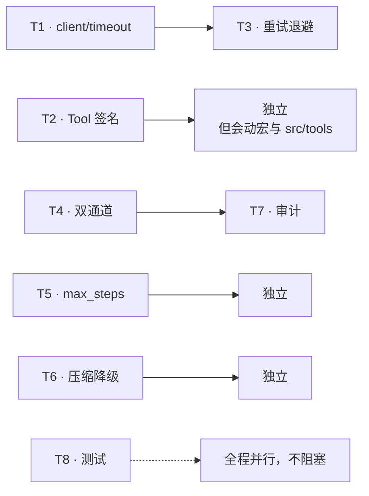

**Shirley 技术方案 · 错误处理统一化（执行计划）**

本文档记录"统一集中处理 Agent SDK 错误"这项工作的已完成部分与后续任务清单。
它承接 `runtime-hardening.md` 第二节（结构化错误）与 `README.md` 的"失败要可分类"原则，
把设计意图落成可核对的状态。

---

**一、为什么要做**

`docs/README.md` 里写的原则是"失败要可分类"，但当前代码里没有任何一处真的做到了：

- `AdapterError` 只有 `RequestError(String)` / `ResponseError(String)` 两个变体，HTTP 状态码在 `format!` 里被拼成字符串后就消失了，429 和 400 长得一模一样。
- `AgentError` 手写 `Display`，其中 Adapter 分支用 `{error:?}`，代码里自己标了 `todo: 这里应该格式化一下错误`。
- `ToolError` 没有实现 `std::error::Error`，无法参与 `?` 传播与错误链。
- `WorkspaceError` 既没有 `Display` 也没有 `Error`，还从 `futures::io` 引入了其实等价于 `std::io` 的类型。
- `adapter::codec` 与 `invoke` 的流式分支用 `todo!()` 表达"协议未实现"，切协议会让宿主进程 panic。

结论：**重试、降级、取消这三件事都依赖"这个错误是哪一类"，而当前没有任何一个错误类型携带这个信息。**
所以结构化错误必须排在功能扩张之前。

---

**二、设计结论（与 sandbox 的关系）**

最初的假设是"照 sandbox 的错误那样处理"。核对后确认：sandbox 的**模式**可以借鉴，但**不能照抄**。

sandbox 是叶子模块，只面对 `std`，所以它可以把自己的错误定义在自己模块里、扁平、简单。
而 Agent SDK 是分层的，错误需要自下而上汇聚。照抄的结果会是一个巨大的扁平 enum，反而更难维护。

因此从 sandbox 抽出的是四条契约，而非它的代码：

1. 错误定义在**拥有它的模块里**，不集中到一个 `errors.rs`。
2. 扁平 enum，变体带**结构化数据**，不是全 String。
3. 实现 `Display` + `std::error::Error` + `From`，让 `?` 能自动转换。
4. **错误通道与结果通道分开**：命令跑挂了走 `SandboxOutput.exit_code`，沙盒自己坏了才走 `Err`。

最终落地形状是"分层定义 + 统一契约 + 顶层收敛"。

---

**三、第一步已完成：错误契约与结构化错误**

**3.1 交付物**

新增 `crates/shirley-agent-sdk/src/error.rs`：

- `ErrorKind`：7 个稳定分类，用于日志 / 指标 / 审计，不随文案变化。
  - `Transport` / `RateLimited` / `ServerError` / `BadRequest` / `Unsupported` / `ToolFailure` / `Internal`
- `ErrorKind::is_retryable()`：分类到可重试性的唯一映射。
  - 可重试：`Transport`、`RateLimited`、`ServerError`
  - 不可重试：`BadRequest`、`Unsupported`、`ToolFailure`、`Internal`
- `ErrorKind` 的 `Display`：给每个分类一句稳定中文文案。
- `SdkError` trait：`kind()` 必须实现，`is_retryable()` 默认由 `kind()` 推导，具体类型可覆盖。

新增依赖：`crates/shirley-agent-sdk/Cargo.toml` 显式加入 `thiserror = "2.0.21"`。
（该版本此前已被其他 crate 间接引入 `Cargo.lock`，但 SDK 自己没声明。）

**3.2 各层改造**

| 类型 | 文件 | 变化 |
| --- | --- | --- |
| `AdapterError` | `adapter/mod.rs` | 重写为 `Transport(#[source] reqwest::Error)` / `Http{status, body}` / `Decode` / `Encode` / `UnsupportedProtocol`；`thiserror` 派生；实现 `SdkError` |
| `AgentError` | `runtime/mod.rs` | 变体改名并 `#[from]` 收敛 Tool / Adapter / Sandbox / Workspace；删除手写 `Display`；实现 `SdkError` |
| `ToolError` | `tool/mod.rs` | 补上缺失的 `std::error::Error`；实现 `SdkError`；构造点改名 |
| `SandboxError` | `sandbox/backend/mod.rs` | 实现 `SdkError`（`BackendUnavailable` / `Unsupported` → `Unsupported`） |
| `WorkspaceError` | `workspace/mod.rs` | 改为 `thiserror` 派生，补 `Display` / `Error`；`futures::io` 换回 `std::io`；实现 `SdkError` |

**3.3 顺带清掉的三个 panic 点**

这三个都在 `adapter` 层，原本用 `todo!()` 表达"未实现"：

1. `codec` 的 `_ => todo!()` → `Err(AdapterError::UnsupportedProtocol { protocol })`
2. `invoke` 流式分支的 `_ => todo!()` → 同上
3. `chat_completions` SSE 解析中 `id:` 行的 `todo!()` → 忽略该行，注释写明等实现断线重连时再消费 `last_event_id`

依据是 `runtime-hardening.md` 第七节：**SDK 里任何未实现路径都必须返回 `Err`，绝不在 SDK 里 panic。**

**3.4 一个容易被忽略的关键修复：HTTP 状态码不再丢失**

改造前：

```rust
if !status.is_success() {
    Err(AdapterError::ResponseError(format!("HTTP {status}\n{text}")))?;
}
```

状态码被格式化进字符串后，调用方拿到的只是一句话，无法区分 429（该退避重试）和 400（重试无意义）。

改造后抽出 `ensure_success(response)` 统一处理，保留 `status: u16` 与 `body: String` 两个字段。
之所以抽成独立函数，是因为 `reqwest::Response` 只能被消费一次，"先检查状态、后读 body"必须在同一处完成，
而流式与非流式两条分支都需要这段逻辑。

**3.5 公开导出**

`lib.rs` 增加了 `pub mod error`、`pub mod workspace`，以及 `AdapterError`、`ErrorKind`、`SdkError` 的 re-export。

其中 `AdapterError` 与 `workspace` 的导出是 Rust 私有类型泄漏规则逼出来的：
`AgentError::Adapter` 是公开变体，它包裹的类型如果不公开，下游就无法匹配。
若后续希望收窄公共 API，可以考虑给 `AgentError` 提供不透明访问器来替代直接暴露变体。

**3.6 展示文案格式统一**

四层错误原本用了两套 convention：`ToolError` / `SandboxError` 手写 `Display`、带 `[前缀]:`；
`AdapterError` / `WorkspaceError` 走 thiserror、裸文案。现统一为**一套机制 + 一套格式**：

- 机制：全部走 thiserror 派生，删掉两段手写 `Display` match（`SandboxError` 的手写 `From<io::Error>` 也由 `#[from]` 取代）。
- 格式：全部为 `[前缀]: 详情`，`AdapterError` / `WorkspaceError` 补上方括号。

前缀**留在各变体旁，不从 `ErrorKind` 推导**。原因是映射是多对一的：
`ToolError::NotFoundError` 与 `ArgumentsError` 同属 `BadRequest`，
`SandboxError::BackendUnavailable` 与 `Unsupported` 同属 `Unsupported`。
若把前缀挂到 `ErrorKind`，这些变体会渲染成同一句话，模型就分不清
"工具不存在"（换工具）与"参数写错了"（改参数）——后者它自己能修。
`ErrorKind` 是粗粒度的重试决策轴，前缀是细粒度的人类标签，两者正交。

**3.7 测试**

新增 `crates/shirley-agent-sdk/tests/error_contract.rs`，6 个用例，锁的是**分类语义而非文案**：

- `http_status_maps_to_kind`：429→`RateLimited`、5xx→`ServerError`、4xx→`BadRequest`
- `unsupported_protocol_is_error_not_panic`：未实现协议返回 `Err`
- `decode_and_encode_are_not_retryable`：解析 / 编码失败不可重试
- `retryable_kinds_are_stable`：7 个分类的可重试性行为
- `every_kind_has_display_text`：每个分类都有展示文案
- `error_source_chain_is_preserved`：`Http` 的展示文案包含状态码与错误体

**3.8 验收结果**

- `cargo check --workspace` 通过，无新增 warning（SDK 侧 11 条，全部是既有的 dead_code）。
- `cargo test -p shirley-agent-sdk`：`error_contract` 6/6、`sandbox_smoke` 6/6、doc test 1/1。
- 四层错误（`Tool` / `Adapter` / `Sandbox` / `Workspace`）共 11 个变体的 `Display` 输出已逐一核对，全部为 `[前缀]: 详情` 格式。
- `cargo test --workspace` 有 1 个失败：`tools::bash::tests::reports_sandbox_degradation`。
  **该失败在改动前即存在**（已用 `git stash` 在干净代码上复现），原因是 `src/tools/bash.rs` 的 `render()`
  中降级提示被注释掉了，而测试仍在断言它。与本次改动无关，未处理。

**3.9 明确未做**

- `Tool` trait 的签名没有改（见后续任务 T2），宏里仍然是 `map_err(AgentError::Tool)?` 硬转。
- 重试、退避、超时接线没有做（只提供了 `is_retryable` 这个决策依据）。
- 错误通道与结果通道仍然混在一起（见 T4）。

---

**四、后续任务**

按依赖顺序排列。T1 是其余任务的前置——重试、降级、取消全都要问 `is_retryable`。

**T1 · 接线 `request_timeout` 与 `reqwest::Client` 复用**（P0，独立）

- 现状：`runtime/mod.rs` 的 `run_stream` 每次调用 `reqwest::Client::new()`，连接池不复用；`ModelConfig.request_timeout` 已定义但从未使用。
- 做法：`Agent` 持有一个 `reqwest::Client`，在 builder 阶段用 `request_timeout` 配置；`invoke` 改为接收 `&Client`。
- 验收：慢接口能触发超时；连续多轮 `run` 复用同一连接池。

**T2 · `Tool` trait 签名归位**（P0，破坏面最大，放最后做）

- 现状：`ToolFuture = Future<Output = Result<Value, AgentError>>`，但工具作者写的是 `Result<String, ToolError>`，宏里 `map_err(::shirley_agent_sdk::AgentError::ToolError)?` 硬转。结果是工具作者被迫感知 `AgentError`——而它是 SDK 边界类型，不是工具该看到的东西。
- 做法：`ToolFuture` 改为 `Result<serde_json::Value, ToolError>`；宏里删掉 `map_err`；由 runtime 在调用点用 `?` 收敛到 `AgentError`。这与 sandbox 一致——`ProcessBackend::execute` 只返回 `SandboxError`。
- 影响面：`crates/shirley-agent-sdk-macros/src/tool.rs`、`crates/shirley-agent-sdk/src/tool/mod.rs`、`src/tools/bash.rs`。
- 验收：工具函数签名只需 `Result<_, ToolError>`；现有 6 个 bash 测试全过。

**T3 · 重试与指数退避**（P0，依赖 T1）

- 现状：429 / 5xx / 超时全部直接冒泡，一次网络抖动废掉整轮长任务。
- 做法：在 `invoke` 外层包一层重试，用 `SdkError::is_retryable()` 判断；`RateLimited` 优先解析 `Retry-After` 响应头；退避带抖动。
- 建议补充：给 `AdapterError` 加 `retry_after()` 方法（`runtime-hardening.md` 已列出接口）。
- 验收：注入 429 / 500，自动退避重试后继续；注入 400，立即失败不重试。

**T4 · 错误通道与结果通道分离**（P0）

- 现状：`runtime/mod.rs` 里工具失败是 `Err(error) => error.to_string()` 直接喂给模型，外部消费者完全看不到；旁边代码里有 `TODO: 感觉这里不太合理`。
- 做法：双通道。`ToolError` 已 `derive(Serialize)`，内容进 `Message::Tool` 让模型自我纠正；同时新增 `AgentEvent::ToolFailed { call_id, error }` 给 UI 与审计。
- 依据：`security.md` 6.1——模型需要看到失败细节才能自我纠正；但审计需要结构化字段，不能只有一句话。
- 验收：模型侧能看到 stderr 与退出码；UI 侧能拿到结构化错误分类。

**T5 · `max_steps` 与终止语义**（P0）

- 现状：`StopReason::MaxStepsReached` / `Cancelled` 已定义但代码里没有任何地方产生它们；主循环唯一出口是"本轮没有 tool_calls"。
- 做法：builder 加 `max_steps`（默认 32），主循环带计数；到达上限时以 `MaxStepsReached` 结束并返回已有消息。
- 验收：构造持续返回 tool_calls 的假响应，Agent 在 `max_steps` 后正常结束而非无限循环。

**T6 · 压缩失败降级**（P1）

- 现状：`compress_context` 失败即中断整个 stream；且压缩后若摘要本身仍超阈值会立刻再次触发压缩（抖动）。
- 做法：压缩失败时保留原消息继续任务，通过事件上报；压缩后判断摘要是否仍接近阈值，是则不重复压缩。
- 验收：压缩指令导致模型返回空内容时，任务继续而非中断。

**T7 · 审计与日志接入 `ErrorKind`**（P1）

- 现状：`security.md` 6.3 要求的审计日志 `~/.shirley/audit.log` 尚未落地。
- 做法：审计记录 `(timestamp, tool, arguments, decision, ErrorKind, exit_code)`；日志用 `ErrorKind` 而非 `to_string()` 作为分类维度。
- 依赖：T4 提供结构化错误事件。
- 验收：日志可按 `ErrorKind` 聚合统计；被拦截的调用有记录。

**T8 · 测试补强**（P1，可与上述并行）

- `testing.md` 要求的 Usage 单测（`Option` 语义、`Add` 的"保留已知一侧"行为）尚未编写，而 `message` 是被多处复用的地基，改动风险最高。
- 缓存命中率基准：用简单 case 跑真实 API，验证 prefix 稳定性，设定阈值。
- 验收：`message::Usage` 有覆盖 `None` 与 `Some(0)` 差异的单测。

---

**五、依赖关系**



关键判断与 `roadmap.md` 一致：**结构化错误是很多事的前置**。
本步骤（第三节）已经交付了这个前置，后续 T1–T6 都可以直接消费 `is_retryable` 与 `ErrorKind`，
不必再各自发明判断逻辑。

---

**六、风险与注意**

1. **`Tool` trait 签名改动（T2）破坏面最大**，会同时触及宏、SDK 与 `src/tools/`。建议单独一次提交，且在此之前不要并行改工具实现。
2. **`ErrorKind` 是稳定契约**。文案可以改，分类不能随意增删或改语义——上层的重试决策挂在它上面。新增分类时应同步更新 `is_retryable` 与 `error_contract.rs`。
3. **`AgentError` 目前直接暴露了包裹类型**（见 3.5）。若后续要收窄公共 API，应在一个版本内完成，避免下游已经 `match` 之后再加破坏性改动。
4. **`futures::io` 与 `std::io`**：`workspace` 原先用的是 `futures::io::Error`，它其实是 `std::io::Error` 的 re-export，属于误导性 import，已改回 `std::io`。类似写法值得全仓扫一遍。
