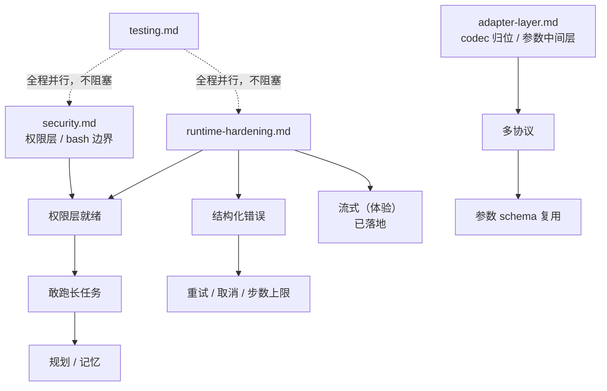

**Shirley 技术方案 · 总路线图**

**一、判断**

当前仓库是一个"链路跑通了、但还不能托付真实仓库"的 v0.1。ReAct 循环、工具注册、上下文压缩、usage 统计、TUI、流式输出都已经能跑，`plan.md` 的方向也是对的。问题集中在两类：

- **边界类**：能跑，但一旦接入真实场景就会咬人（安全、无上限循环、无重试、协议 panic）。
- **沉淀类**：`plan.md` 说清了要做什么，但一直没做（参数中间层、记忆、规划）。

前者是 P0，因为它决定了这个 Agent 能不能动我的代码。后者是 P1，因为它决定了后续每一步的边际成本。

**二、分期**

**P0 · 让它可信（不动架构）**

目标：能在真实仓库上跑一次迁移任务，中途不出灾难。

- 安全边界（见 `security.md`）
  - 密钥轮换 + `.env.example`
  - `bash` 返回 stderr / exit code，修黑名单绕过
  - 工作区根目录限制（cwd 白名单 + 路径规范化）
  - 通用权限层（`PermissionPolicy`），替代硬编码黑名单
- 运行时加固（见 `runtime-hardening.md`）
  - `max_steps` 上限，让 `StopReason::MaxStepsReached` 真正产生
  - `request_timeout` 接线 + `reqwest::Client` 复用
  - 结构化错误 + 可重试判定 + 指数退避
  - `todo!()` 改为 `Err`
  - 压缩失败降级而非中断

**P1 · 让它好用、且后续便宜**

- ~~流式输出与 reasoning 流式（见 `streaming.md`）~~ ——已落地（`stream` 配置 + `ContentDelta` / `ReasoningDelta` + SSE 增量解析）
- 适配中间层：工具参数标准化、`encode_messages` 归位（见 `adapter-layer.md`）
- SDK 单测 + 缓存命中率基准（见 `testing.md`）

**P2 · 让它变强**

- 记忆系统（"蒸馏验证"入库）
- 任务规划与进度跟踪
- 多协议（Responses / Anthropic）真正落地
- ~~会话持久化与恢复~~ ——已落地（`session` 模块 + `docs/session.md`；SDK 定 `SessionStore` 契约，应用层 `JsonlSessionStore`）

**三、依赖关系**

关键判断：**结构化错误是很多事的前置**。重试策略、压缩降级、取消语义，都依赖"这个错误能不能重试"。所以 `runtime-hardening.md` 里的错误改造应该排在该文件内部的第一项。

**四、验收口径**

P0 完成的定义（可测）：

1. 对仓库执行一次真实迁移子任务，全程无人为干预，不出现无限循环。
2. 注入一次 429 / 500，Agent 能自动退避重试并继续。
3. `bash` 执行一个编译失败命令，模型能拿到 stderr 与退出码。
4. 尝试 `read_file` 工作区外的文件被拒绝，并有明确错误。（**已实现**：`src/tools/read.rs`，经 `WorkSpace::resolve` 校验）
5. 切到未实现的协议返回 `Err` 而非 panic。

P1 完成的定义：

1. TUI 能看到逐字输出与 reasoning 流。（已实现）
2. `cargo test -p agent-sdk` 覆盖 Usage 语义、压缩切片、阈值判断。（仍未做，SDK 侧 0 测试）
3. 缓存命中率有基准用例与阈值，UI 上的百分比有参照。（仍未做）

**五、不做的事（明确划界）**

- 不在这一轮引入向量库 / 外部记忆存储。
- 不重写 TUI，只在事件层做减法（去掉 `AgentUpdate` 重复翻译）。（已完成）
- 不为多协议提前抽象到"什么都能转"，只做参数 schema 这一层必要的标准化。
