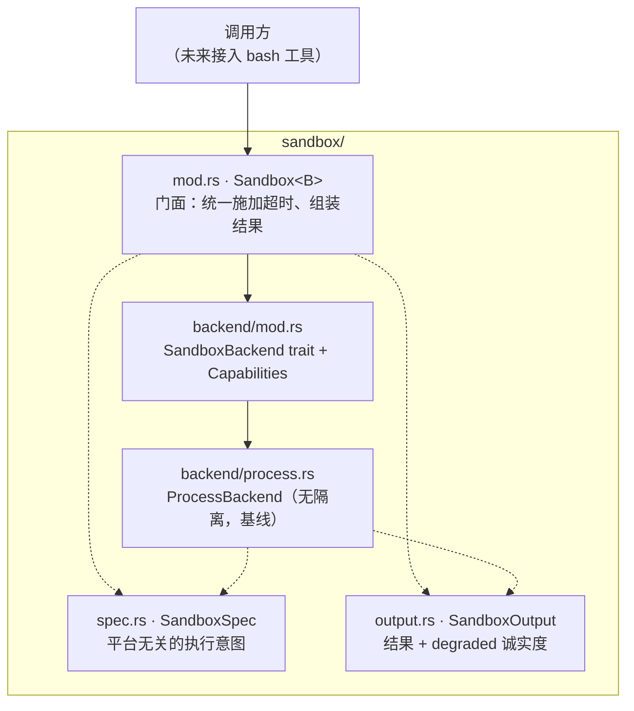
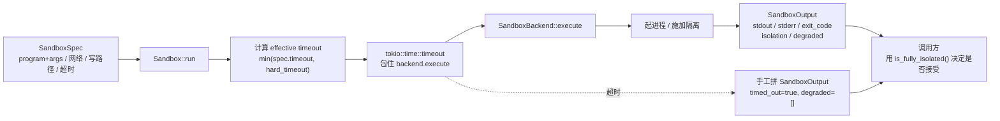

**Shirley 技术方案 · 进程沙盒（P0）**

本文沉淀 `crates/shirley-agent-sdk/src/sandbox/` 当前的设计。它是 `security.md` 第六节"运行时约束"里"OS 级沙箱"那一步的落地，回答一个问题：**当 Agent 要执行外部命令时，怎么保证它跑在一个"假世界"里，闹不到真世界。**

**一、为什么单独立一层**

`security.md` 已经把边界定在"工作区根目录"这一层，但那只解决了"文件读写越界"。`bash` 这类工具真正的问题更深：它把任意命令交给 shell，而命令的语义**无法在字符串层面静态判断**（`/bin/rm`、`base64 | bash`、`r''m` 都是绕过）。结论是：**不要在命令字符串上做模式匹配，要在"能碰什么"这一层做物理隔离。**

沙盒层因此与权限层（`PermissionPolicy`）分工明确：

| 层 | 回答的问题 | 时机 |
| --- | --- | --- |
| 权限层 policy | "该不该执行这条命令" | 执行前，静态决策 |
| 沙盒层 sandbox | "执行了也碰不到真世界" | 执行时，物理约束 |

正确顺序是 `policy.check() -> Allow/Deny/Ask`，放行后再交给 `Sandbox::run`。**沙盒不替 policy 做决策，policy 也不假设沙盒一定存在。**

**二、五条设计原则**

1. **边界在"能碰什么"，不在命令字符串。** `SandboxSpec` 用 `program + args` 分离传递，不做 `bash -c "..."`。语义藏在字符串里就无法静态判断，这是 `bash.rs` 现状的根因。
2. **默认拒绝。** 网络默认断（`NetworkPolicy::Disabled`），环境变量默认不继承（`env_clear` 后再注入），写路径默认空。要放开必须显式声明。
3. **可替换后端。** 隔离机制由 `SandboxBackend` trait 提供。本地开发用 `ProcessBackend`，生产换 `bwrap` / `sandbox-exec` / microVM。换后端时门面与上层调用一行不改。
4. **超时不可逃避。** 超时由门面 `Sandbox::run` 在最外层用 `tokio::time::timeout` 施加，配合后端的 `kill_on_drop`。后端即使想赖着不停也会被 drop + kill，不依赖进程自觉退出。
5. **降级透明。** 后端做不到的约束必须写进 `SandboxOutput::degraded`，上层可据此拒绝结果，而不是被"看起来跑了"骗过去。

**三、分层结构**



职责边界：

- **`spec.rs`** 只描述意图，与平台无关。"我想跑什么、允许它碰什么"。
- **`backend/`** 把意图落地为真实执行。**只负责执行与隔离**，不做权限决策，不负责超时（超时归门面）。
- **`output.rs`** 统一结果。保留 `stderr` / `exit_code`（模型要看到失败细节才能自我纠正，见 `security.md` 6.1），以及 `degraded`（审计要知道当时隔离是否真的生效）。
- **`mod.rs`** 门面。施加超时、组装结果，其余全部透传。

**四、一次执行的完整数据流**



**五、`degraded` 是什么，谁给出来的**

`degraded` 是**后端自愿上报的"认怂声明"**：它一边执行，一边对照 `spec` 里要求的约束，逐条检查自己做到了没有，做不到的 push 进列表。

它**不是**事后监控记录，而是**事前就知道自己几斤几两**。`ProcessBackend` 从出生起就知道"我不会隔离"，所以不需要监控任何东西，它直接声明"我啥也拦不住"。它每次执行都会填：

```
无文件系统隔离：进程可访问宿主整个文件系统
无资源限制：未施加内存/进程数上限
无网络隔离：NetworkPolicy::Disabled 未被强制
```

三方分工：

| 角色 | 对 degraded 做什么 | 位置 |
| --- | --- | --- |
| 后端实现 | **写**——对照 spec 逐条上报做不到的约束 | `backend/process.rs`（未来 bwrap/sandbox-exec 同此） |
| 门面 `Sandbox` | **基本不碰**——仅超时路径给空 `Vec`（超时不算隔离降级） | `mod.rs` |
| 调用方 | **读**——`is_fully_isolated()` / 遍历，决定接不接受结果 | 上层业务 |

**关键限制**：`degraded` 目前是后端**自报**的，理论上可以被偷懒的实现骗过。生产化时应加一层**外部验证**——后端启动时跑自检探针（试着往工作区外写、试着连外网），用实际行为校验它声明的能力，而不是只听它说。

**六、后端选型路线**

`ProcessBackend` 只是把链路跑通，**绝不可用于不可信输入**。按平台接真实隔离：

| 平台 / 场景 | 后端 | 隔离强度 |
| --- | --- | --- |
| 本地开发 / 测试 | `ProcessBackend` | 无（degraded 全填） |
| macOS | `sandbox-exec`（SBPL profile：`(deny default)` + 放行 read/write/network） | 中 |
| Linux | `bwrap`（`--ro-bind` / `--tmpfs` / `--unshare-net` / `--die-with-parent`） | 中 |
| Linux 高保证 | `gVisor`（runsc） | 高（用户态内核） |
| 多租户 / 极致隔离 | `Firecracker` microVM（独立内核） | 最高 |

新增后端只需实现 `SandboxBackend` 一个 trait，门面与上层调用无需改动。这正是把它做成 trait 的意义：**先把链路和契约固定，隔离强度作为可插拔的实现。**

**七、能力矩阵**

`Capabilities` 是后端**静态声明**它能做什么；`degraded` 是**本次执行**实际降级了什么。上层两者都要看：

| 后端 | filesystem | network | resource | 运行时 degraded |
| --- | --- | --- | --- | --- |
| `ProcessBackend` | ✗ | ✗ | ✗ | 每次全填 |
| `bwrap` 正常 | ✓ | ✓ | 部分 | 空 |
| `bwrap` 未装成 | ✓ | ✓ | 部分 | "本次隔离未起来"（临时认怂） |

**八、验收**

1. `SandboxSpec` 用 `program + args`，不经过 shell，`/bin/rm`、`r''m` 这类绕过在结构上不成立。
2. 环境变量默认不继承：宿主设 `SANDBOX_LEAK_TEST`，沙盒内读不到；显式注入的才可见。
3. 超时由门面强制：`sleep 5` + 200ms 超时必须返回 `timed_out=true`，且进程被清理。
4. `ProcessBackend` 每次执行 `is_fully_isolated() == false`，`degraded` 非空。
5. 命令失败时模型能拿到 `stderr` 与 `exit_code`（承接 `security.md` 6.1）。
6. 接真实后端后，尝试写工作区外必须失败，`degraded` 为空。

当前已覆盖 1–5（见 `crates/shirley-agent-sdk/tests/sandbox_smoke.rs`，6 个用例）。第 6 项待接 `sandbox-exec` / `bwrap` 后端后补齐。

**九、设计缺口：谁决定工具是否沙盒化**

当前实现里，**是否走沙盒是工具作者自己决定的**。看 `src/tools/bash.rs`：

```rust
let sandbox = Sandbox::new(ProcessBackend::default());
let output = sandbox.run(&spec).await?;
```

是 `bash` 工具**自己选择**调用 `Sandbox::run`。任何工具都可以**不选**——直接 `tokio::process::Command::new(...)` 起进程，绕过沙盒，SDK 不会拦它。

**三种可能的归属**

| 方案 | 谁决定 | 评价 |
| --- | --- | --- |
| A（现状） | 工具作者，在工具代码里 | 灵活，但默认不安全、策略分散、后端硬编码 |
| B | SDK 统一规定：所有工具默认走沙盒 | 安全，但不够灵活（有些工具本不该被沙盒） |
| C | 装配方（`main.rs`）在注册工具时声明 | 集中、可配置、默认安全 |

**正确方向是 C，其次 B，最不该是 A。**

**为什么 A 最差**

1. **默认不安全。** 工具作者忘了用沙盒、或图省事直接 `Command::new`，就是裸跑。安全取决于"每个作者都记得"，这是最脆弱的设计——默认放行，靠自觉拒绝。
2. **策略散落。** 工作区、超时、网络、后端，现在都写在 `bash.rs` 里。写第二个外部执行工具时又要重新决定一遍，且无法集中审计。
3. **后端换不了。** `bash.rs` 硬编码了 `ProcessBackend::default()`，换后端得逐个工具改。
4. **与原则冲突。** `security.md` 原则三说"权限策略是 SDK 能力，不是应用层硬编码"。现在隔离策略是**工具层硬编码**，比应用层还下沉一层。

**应该长什么样（方向，非当前改动）**

工具只声明"执行需求"，SDK 统一施加，后端由装配方注入：

```rust
// 工具只描述"我要跑外部命令"，不决定隔离方式
trait Tool {
    fn definition(&self) -> &ToolDefinition;
    fn invoke(&self, input: Value) -> ToolFuture;
    // 新增：声明执行需求，默认 = 必须沙盒 + 最严约束
    fn execution_policy(&self) -> ExecutionPolicy;
}

// 装配方在 main.rs 决定后端与默认策略
let agent = Agent::builder()
    .sandbox_backend(ProcessBackend::default())  // 或 sandbox-exec / bwrap
    .tool(bash::tool())        // 声明需要沙盒
    .tool(read::tool())        // 声明需要文件系统约束
    .tool(http_fetch::tool())  // 显式声明允许出网
    .build()?;
```

要点：默认沙盒化（不声明就用最严默认）；工具声明"需要什么"，SDK 决定"怎么满足"；后端由装配方注入，不硬编码；策略集中可审计。

**技术卡点**

落地"装配方注入后端"卡在 object-safety：`SandboxBackend::execute` 返回 `impl Future`，trait **不是 object-safe**，无法 `Box<dyn SandboxBackend>` 动态注入（见 `bash.rs` 内 TODO）。需先把 `execute` 改成返回 `BoxFuture<'_>`（`Pin<Box<dyn Future + Send>>`），牺牲少量性能换 object-safety。

**时机建议**

现在只有 `bash` 一个工具、`ProcessBackend` 一个后端，A 方案的坏处尚未暴露，**不急于改架构**。等出现第二个、第三个需要外部执行的工具时再做"声明 + 注入"，边际收益最大。届时应同时补上 `ExecutionPolicy` 与 object-safe 的 `SandboxBackend`。

**十、尚未完成（明确划界）**

- **真实隔离后端**：`sandbox-exec` / `bwrap` / microVM 均未接。当前只有 `ProcessBackend`。
- ~~**`Sandbox` 未接入 `bash` 工具**~~：已接入。`src/tools/bash.rs` 走 `Sandbox::run`，保留 `bash -c`（不破坏管道/重定向），超时交给门面，结果含 stderr/exit_code/降级提示。黑名单降级为"临时静态兜底"。
- **`degraded` 的外部验证**：目前只信后端自报，无自检探针。
- **出网代理**：`NetworkPolicy::Proxy` 只是一个声明，代理本身（域名白名单 + 审计 + 内容检查）未实现。这是防数据外泄的关键层，也是事故高发区。
- **执行策略归属未上收**：当前是否走沙盒由工具作者自行决定，见第九节。等第二个外部执行工具出现时一并解决。
- **审计落盘**：`SandboxOutput` 已 `Serialize`，但尚未写入 `~/.shirley/audit.log`（见 `security.md` 6.3）。
