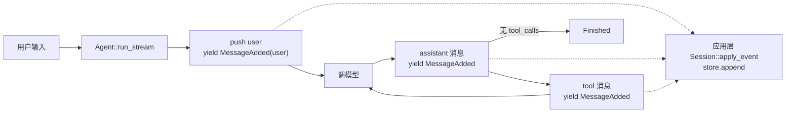
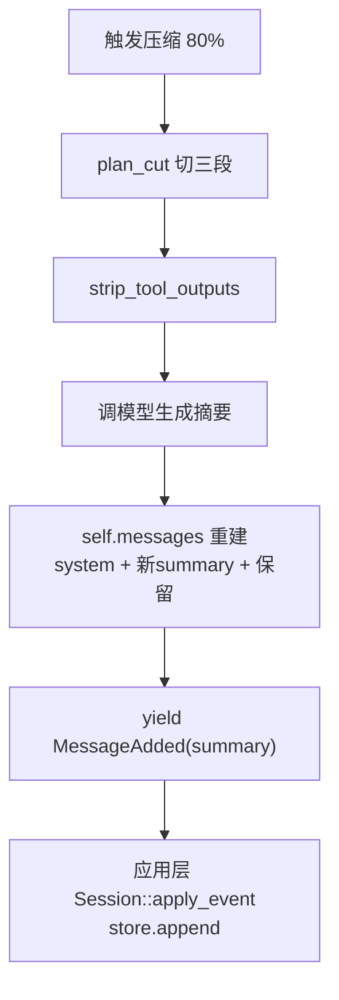
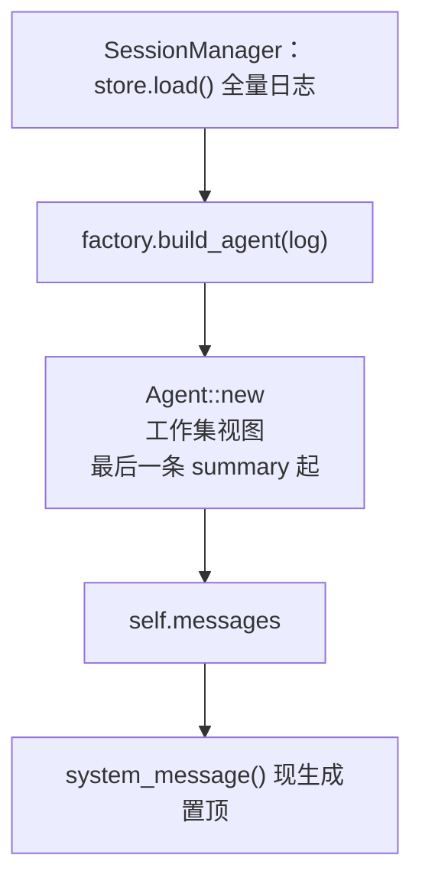

**Shirley 技术方案 · 会话持久化与恢复**

这份文档把 `plan.md` 里那句"聊到一半 AI 模型挂了，我不敢关闭窗口"落地成方案。

**范围声明**：本轮只定 SDK 侧契约与恢复语义。具体存储后端（SQLite / JSONL / …）
由应用层实现，SDK 不关心。持久化的是**原始 Message 全量日志**，
**不持久化 system 提示词**（system 恢复时现生成）。

---

**一、核心决策（先定调）**

**决策 1：持久化的是原始 Message。**

持久化的是**原始 Message 全量日志**：日志就是唯一数据源，恢复时由它重建工作集。
不存在"日志和别的派生结构对不上"的事务问题——因为只有一份数据。

**决策 2：system 提示词不入日志，恢复时重新生成。**

`system_prompt` 可能是函数形式，按 `SystemPromptContext`（工作目录）动态解析，
内容会随 `Agent.md`、工作目录变化。压缩重建时就是这么做的
（`compress_context` 里 `system_message()` 现取一条置顶，不从旧消息复制）。
**恢复必须复用同一套规则**：日志里不含 system，`Agent::new` 时现生成。

**决策 4：日志只追加；rewind 只截尾。**

持久化日志是 append-only 的（正常轮次、压缩、都走追加）。唯一例外是 rewind——
它**只作用于最后一条用户消息**（应用层 `/rewind` 从"任选历史某条"收窄为"只回退最新一条"）。
因为是"只动尾巴"，所以 rewind = `messages` 截尾 + 日志同步截尾，**不存在中间空洞**。

> 为什么不做"任意位置 rewind + 前缀游标"：一旦允许在中间 rewind 后重发，
> 日志里会出现"废弃分支 → 新分支"的洞，前缀游标无法表达，恢复会错位。
> 只截尾把这个复杂度整个消掉了。若将来真要审计废弃分支，得上操作日志
> （`Append` / `RewindTo` 序列），复杂度高一个量级，现在不需要。

**决策 5：`messages` 与 `session` 的真相源优先级——构造时由 messages 裁决。**

- `messages` 非空 → **以它为准，重置 session 到 messages 的样子**；
- `messages` 为空 → 从 `session.load()` 恢复。

若不定死这条，attach 一个已有内容的 session 时会出现"幽灵消息"：
session 有旧尾巴、messages 是真相，挂载后追加就分叉，下次冷启动幽灵复活。
"messages 为准"就等于"挂载那一刻 session 必须被重置成 messages 的样子"。

---

**二、应用层契约**（**已演进：契约从 SDK 移出**）

> 多会话重构后，会话持久化**完全归应用层**：`SessionStore` / `SessionError` 与
> 具体实现同住在 `src/session.rs`，SDK 不再持有任何会话概念（`Agent` 无 `session`
> 字段、无恢复 / 落库 / 截尾逻辑，只发 `MessageAdded` 事件）。下面这节记录契约
> 的**形态**（内容不变，归属改为应用层），历史归属见第七节。

**2.1 `SessionStore` trait**

```rust
// src/session.rs（应用层）
pub trait SessionStore: Send + Sync {
    /// 追加一条消息到日志尾部。压缩产生的 ContextSummary 也走这里。
    fn append(&self, message: &Message) -> Result<(), SessionError>;

    /// 读取全量日志（只读、顺序）。
    fn load(&self) -> Result<Vec<Message>, SessionError>;

    /// 截断到前 len 条（rewind 用；只截尾）。
    fn truncate(&self, len: usize) -> Result<(), SessionError>;
}
```

三个方法对应三种操作，**恰好是架构里的全部写入语义**：追加（正常轮次 + 压缩）、
读回（恢复）、截尾（rewind）。**故意没有** `delete` / `update` / `search`——用不到。

**设计要点**：

- **接口收 `&Message`，不收 `&[Message]`，更不收 raw JSON。**
  存的是 SDK 语义类型，换协议（OpenAI / Anthropic）不动存储层；
  单条追加天然对齐"一轮一轮落库"。
- **同步签名。** 会话的恢复 / 截尾发生在同步路径上（`SessionManager` 切换 /
  `App::submit` 回溯），同步接口让调用方不必变异步。存储后端若是异步驱动，由实现
  内部消化（同步驱动如 `rusqlite` 最省事）。**契约同步，实现自由。**
- **`SessionError` 留在 `src/session.rs`**（与实现同住），`thiserror` 定义，
  展示格式 `[前缀]: 详情`（`Io` / `Backend` 两个变体）。应用层不再经 `#[from]`
  收进 `AgentError`——它已不跨 SDK 边界。

**2.2 错误处理**

`append` 失败 = **暴露为错误**，不降级继续。理由：持久化失败还继续跑，
等于假装有存档，比直接报错更危险。应用层由 `Session::persist_message` 把失败记成
错误条目（UI 可见），但不因此中断整轮对话。

**2.3 对外暴露**

应用层内部类型，不属 SDK 门面。SDK `lib.rs` **不再导出** `SessionStore` /
`SessionError` / `InMemoryStore`。

---

**三、应用层接线**（**已演进：SDK 不再持有会话**）

**3.1 落库挂点：事件驱动**

SDK 的 `run_stream` 对每条入 `self.messages` 的消息都 `yield MessageAdded`
（user / assistant / tool / summary；system 不发），但**不落库**。应用层在
`Session::apply_event` 收到 `MessageAdded` 时 `store.append`——TUI 与 desktop
共用这一条路径（`App::apply_event` → `Session::apply_event`）。

| 事件 | 动作 |
| --- | --- |
| `MessageAdded(user)` | `store.append(user)`（视图条目由驱动方 `begin_turn` / `submit` 记） |
| `MessageAdded(assistant)` | `store.append(assistant)` + 更新视图 |
| `MessageAdded(tool)` | `store.append(tool)` + 更新视图 |
| `MessageAdded(summary)` | `store.append(summary)` + 更新视图 |
| `Session::rewind_last_user_turn` | 回退 `Agent` 内存 + `store.truncate(去 system 长度)` |

**压缩那条要点**：压缩是**追加一条 summary**，不是重写日志。
日志形如 `[原始… 旧summary 更原始… 新summary]` 全都留着，
恢复时 `active_messages` 自然只认最后一条 summary。**与 append-only 自洽。**

**3.2 恢复：load 后 build**

会话持久化在应用层，恢复不再发生在 `Agent::new` 内。`SessionManager` 切换 /
新建时先 `store.load()` 拿回全量日志，再 `factory.build_agent(log)` 起 `Agent`
（`Agent::new` 会把 system 现生成置顶）。日志不含 system，故恢复出的工作集必然与
冷启动一致；`build_agent(Vec::new())` = 全新会话。

**3.3 `rewind` 清理**

```rust
// SDK 侧只回退内存并返回原文（不再截日志）
pub fn rewind_last_user_turn(&mut self) -> Option<String>;

// 应用层 Session 包一层：回退 Agent 内存 + store.truncate
pub fn rewind_last_user_turn(&mut self) -> Option<String>;
```

日志截尾由应用层 `Session::rewind_last_user_turn` 补上——它调 SDK 的
`Agent::rewind_last_user_turn` 拿到回退后的 `agent.messages()` 长度（减去置顶的
system），再 `store.truncate`。"日志怎么截"仍只有一个入口。

---

**四、数据流**

**4.1 正常运行（追加）**



**4.2 压缩（追加 summary，不重写）**



**4.3 恢复（一个数据源，一个视图）**



**4.4 落盘结构（应用层视角）**

```
日志文件 / 表（只追加）:
  ├── Message::User        { content }
  ├── Message::Assistant   { content?, reasoning_content?, tool_calls }
  ├── Message::Tool        { tool_call_id, content? }
  ├── Message::ContextSummary { content }   ← 压缩产物，也追加
  └── (无 System)                            ← system 恢复时现生成

内存派生（不落盘）:
  └── self.messages   = [system] + [最后summary起]
```

---

**五、边界与不变量**

1. **日志不含 system。** 恢复时由 `system_message()` 现生成置顶，反映最新工作目录 /
   `Agent.md`。与压缩重建同一套规则。
2. **日志只追加，唯一例外是 rewind 截尾。** 不存在中间空洞。
3. **`ContextSummary` 是日志里的一等消息**，压缩只追加不重写。
4. **恢复 = 应用层先 `load` 再 `build_agent(log)`**；日志不含 system，
   恢复出的工作集必然与冷启动一致。`Agent` 不再持有会话，也没有"重置 session"语义。
7. **落库由应用层事件驱动**（`MessageAdded` → `append`），SDK 不落库；
   `Session` 是唯一持有 `store` 的容器，写入点不散落。

---

**六、与既有文档的关系**

- **`compaction.md`**：压缩的 `<compacted_range>` 钩子依然成立。
  本文档补充：压缩后的 summary 要进日志，否则恢复时工作集缺一截。
- **`roadmap.md`**：把"会话持久化与恢复"从 P2 提升的依据——它是长任务的地基
  （`plan.md`：模型挂了不敢关窗口），且是 rewind 突破"压缩后不可回溯"的前提。
- **`architecture.md`**：表格里"会话持久化"一行更新为：应用层 `session.rs`
  （`SessionStore` 契约 + `JsonlSessionStore` 实现）+ `SessionManager` 编排；
  SDK 不再持有会话。

---

**七、落地顺序（均已落地；契约已从 SDK 移出）**

> 最初 `SessionStore` 契约落在 SDK（`crates/shirley-agent-sdk/src/session/mod.rs`），
> `Agent` 持有 `session` 字段并在构造 / 写入 / rewind 时同步。多会话重构后，会话被
> **整体抽离到应用层**：SDK 删除 `session` 模块 / 字段 / `SessionError` 变体，
> `rewind_last_user_turn` 只回退内存并返回 `Option<String>`；契约与实现同住
> `src/session.rs`，落库改由应用层事件驱动。

1. ~~**`SessionStore` + `SessionError`**~~ ——已落地，**归属 `src/session.rs`**
   （`thiserror` 定义，`Io` / `Backend` 两变体）；SDK 不再导出。
2. ~~**落库接线**~~ ——已落地：SDK 只 `yield MessageAdded`；应用层
   `Session::apply_event` 收到即 `store.append`（TUI / desktop 共用路径）。
3. ~~**恢复接线**~~ ——已落地：`SessionManager` 先 `store.load()` 再
   `factory.build_agent(log)`；`Agent::new` 只把 system 现生成置顶。
4. ~~**`rewind` 清理**~~ ——已落地：SDK 只留 `rewind_last_user_turn`（返回
   `Option<String>`）；应用层 `Session::rewind_last_user_turn` 包一层，
   按回退后的 `agent.messages()` 长度（减 system）`store.truncate`。

**应用层后端**：`src/session.rs` 的 `JsonlSessionStore` 是真实
`SessionStore` 实现——每行一条 `Message` 落成 JSONL。
`Session` 持有 `Arc<dyn SessionStore>`，会话因此**跨进程重启可见**
（恢复在 `SessionManager` 切换 / 新建时发生）。
`truncate` 先写临时文件再原子替换、重开追加句柄；内部 `rewrite_locked`
必须在已持锁下调用，否则非重入锁死锁。

**验收口径**：

- 不传 session 时，全部现有测试与行为不变；
- 传 session、跑若干轮、重启（新建 Agent 复用同一 store），
  `messages` 与重启前一致（system 除外，system 应反映最新上下文）；
- rewind 后重启，被丢弃的消息**不复活**（日志同步截尾）；
- 恢复出的 system 是**当前**工作目录 / `Agent.md`，不是旧的。

---

**八、多会话切换（`/session`）**

前面七节解决的是"一份会话如何持久化与恢复"。本节解决"如何拥有并切换多份会话"。

**决策 1：一份会话 = 一份独立日志，目录即索引。**

单文件 `<root>/.shirley/session.jsonl` 升级为目录 `<root>/.shirley/sessions/<name>.jsonl`，
每份会话仍是一份完整的 JSONL 日志（复用 `JsonlSessionStore`，语义不变）。
名字默认取创建时间戳（`YYYYMMDD-HHMMSS`），**目录扫描即"列出会话"**——
不需要额外的索引文件，也不会出现"索引与日志对不上"的一致性问题（延续决策 1 的单一数据源）。

**决策 2：切换是 SDK 的接缝，不是应用的 hack。**（**已演进：接缝上移到应用层**）

> **本决策已被 `docs/multi-session.md` 取代**。多会话并行落地（P1）后，
> `Agent::switch_session(Arc<dyn SessionStore>)` 已**从 SDK 移除**——"哪个会话活跃"
> 是应用层编排，由 `SessionManager` 的 `active` 指针承担。每个 `Agent` 对应一份
> 固定日志源，不再有"切换当前会话"这个动作。**进一步（本轮）：`SessionStore`
> 契约本身也已移出 SDK**——SDK 不再持有会话概念，恢复改由应用层 `store.load()`
> 后 `build_agent(log)` 完成，落库改由应用层事件驱动（见第二 / 三节）。
> 下面这段是**单会话时代的过渡语义**，保留作历史记录；当前实现见
> `src/interface/session.rs` 的 `SessionManager::switch_to`。

`Agent::switch_session(Arc<dyn SessionStore>)` 曾是唯一新增的 SDK 对外方法，
与 `/model` 的 `set_model` 对称：模型配置、系统提示词、工作目录、工具、压缩指令
**原样保留**，只替换"当前会话"这一件事。语义与 `Agent::new` 的恢复路径**共用同一套规则**
（`restore_from_session`）：清空内存工作集 → 从新日志重建 → 按当前上下文
现生成 system 置顶。因此"切换出来的工作集"与"冷启动恢复出来的工作集"必然一致。

**决策 3：会话目录（`SessionCatalog`）收敛"会话从哪来"，与 `ModelCatalog` 对称。**

`src/session.rs` 定义 `SessionCatalog` trait（`list` / `open` / `create` /
`create_named` / `create_lazy` / `rename` / `delete`）与本地实现 `FileSessionCatalog`。
`/session` 指令与选择器 UI 只依赖接口，将来若要换成远端 / 数据库后端，UI 不用改。
后四个方法带默认实现（`create_named` / `create_lazy` 回落 `create`，`rename` /
`delete` 报 `Backend` 错），因此不支持元数据的后端（如 `EmptySessionCatalog`）无需改动。

`SessionEntry` 除 `name` / `label` / `preview` 外，还带 `modified_ms`（文件
mtime，列表据此降序）与 `turns`（用户轮数）——对齐 Codex resume picker 展示的
时间与轮数。

**决策 4：启动惰性开一份空会话，兼容旧单文件日志。**

`bootstrap::assemble` 启动时**直接 `create_lazy()` 一份新会话**（而非恢复"最近
修改"的旧会话）：用户跑 coding agent 的起点应是一段干净的新对话，避免一上来就
背上历史会话的上下文。历史会话仍在 `.shirley/sessions/` 目录里，需要时用
`/session` 选择器打开。

**"惰性"= 启动不落盘**（Codex 的 UX）：此刻只确定会话名（供页脚 / 当前会话标记
显示），**不创建文件**；只有真正发消息（`SessionStore::append` 首次被调用）才
物化——按已定的名字落盘 JSONL（并写标题 sidecar）。这样"打开应用但没聊"不会在
列表里留下空会话文件。实现落在 `LazySessionStore`：它就是一个普通
`SessionStore`（由应用层 `Session` 持有、落库路径零改动），差别只是 `append` 首次触发
物化、物化前 `load` / `truncate` 视为空日志 / 空操作。TUI 的「＋ 新建会话」与
desktop 的 `agent_new_session` 同走 `create_lazy`，语义一致。

若发现旧版单文件 `<root>/.shirley/session.jsonl` 且目录尚空，则先把它收编为
`legacy` 会话（`adopt_legacy`），保证升级不丢历史（收编后新会话照常另开一份）。

**决策 5：选择器把"切换"与"新建"合并成一个面板。**

`/session` 打开模态选择器（与 `/model` 同款），列表首项固定是「＋ 新建会话」哨兵
（`name` 为空串），其余为真实会话，每项第二行显示首条用户消息预览（认得出会话）。
确认时按哨兵分流到 `create_lazy`（惰性，见决策 4）或 `open`；确认后重建界面条目
（`rebuild_items_from_agent`）并重置会话绑定的统计（usage / 上下文占用）。

**决策 6：标题是 sidecar，重命名不动标识、不动内容。**

会话名是时间戳（文件 stem），不可读也不好认；允许给它一个**自定义标题**。
标题**不写进 JSONL**——日志只存 `Message`（决策 1），塞标题进去会破坏这条不变量；
而是另存为纯文本 sidecar `<name>.title`（空 / 不存在 = 无标题，回落 `name`）。

`rename(name, title)` **只改标题，不改会话名、不改日志内容**——与 Codex 的
`/rename` 一致（"不改 transcript"）。顺带回避了"改文件名后已打开的
`JsonlSessionStore` 句柄仍指向旧 inode"这类麻烦。`delete(name)` 删除日志，
并 best-effort 删掉标题 sidecar。

**决策 7：desktop 与 TUI 共用同一份会话数据。**

两个界面**共用同一个 `FileSessionCatalog` 实例所描述的目录**
（`<root>/.shirley/sessions`）——这就是"共用一份数据"的落点：在 catalog 层
补齐操作，两个界面自动共享。desktop 侧把工厂里的 `session_catalog`
（此前 TUI 专用）一并塞进 `DesktopState`，新增 commands：

- `agent_list_sessions` / `agent_current_session`：列出 / 查询当前会话；
- `agent_new_session(title?)` / `agent_switch_session(name)`：新建（可命名）/
  切换，均走应用层 `SessionManager`（`create_new` / `switch_to`，与 TUI **同一编排器**）；
- `agent_rename_session(name, title)` / `agent_delete_session(name)`：管理；
- `agent_load_history`：从 `agent.messages()` 取 User / Assistant 正文
  （跳 system / tool / context_summary）成 `HistoryMessageWire`，前端据此重建
  transcript。

会话操作与 `agent_send` **共用 `Arc<Mutex<Option<Agent>>>`**：运行中
`agent=None`，此时任何会话操作返回"agent 正在运行中"，不会并发驱动同一个
`Agent`。前端 `SessionSelector` 参照 `ModelSelector` 范式（点击外部 / Esc 关闭、
listbox），提供新建（可命名）/ 切换 / 重命名（内联编辑）/ 删除（两次点击确认）。

**本期范围**：list / new（可命名）/ switch / rename / delete。
**不做**：fork / archive / 启动 `--resume`（记为后续）。

**验收口径**：

- 切换会话后，工作集只反映新会话；旧会话内容不串入；
- 切换后后续轮次的 `append` 落到新日志，旧日志不被改动；
- 切换出的工作集与"直接冷启动到该会话"完全一致（共用恢复规则）；
- 旧单文件日志在首次启动时被收编，历史不丢；
- **启动不落盘**：打开应用但未发消息时，`.shirley/sessions/` 里不出现空会话文件；
  发出首条消息后会话才出现（TUI / desktop 同）；
- TUI 与 desktop 看到同一份会话列表；在一边新建 / 重命名 / 删除，另一边刷新即可见。
