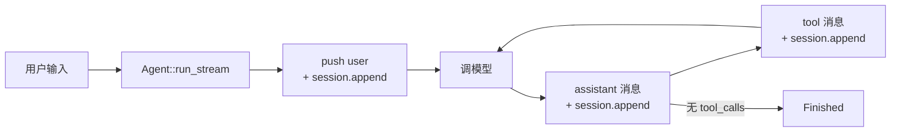
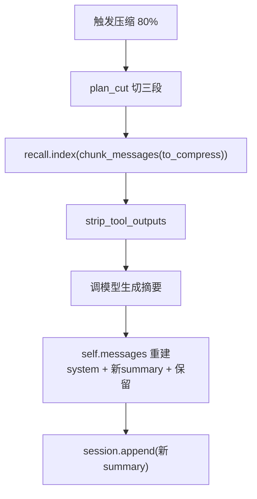
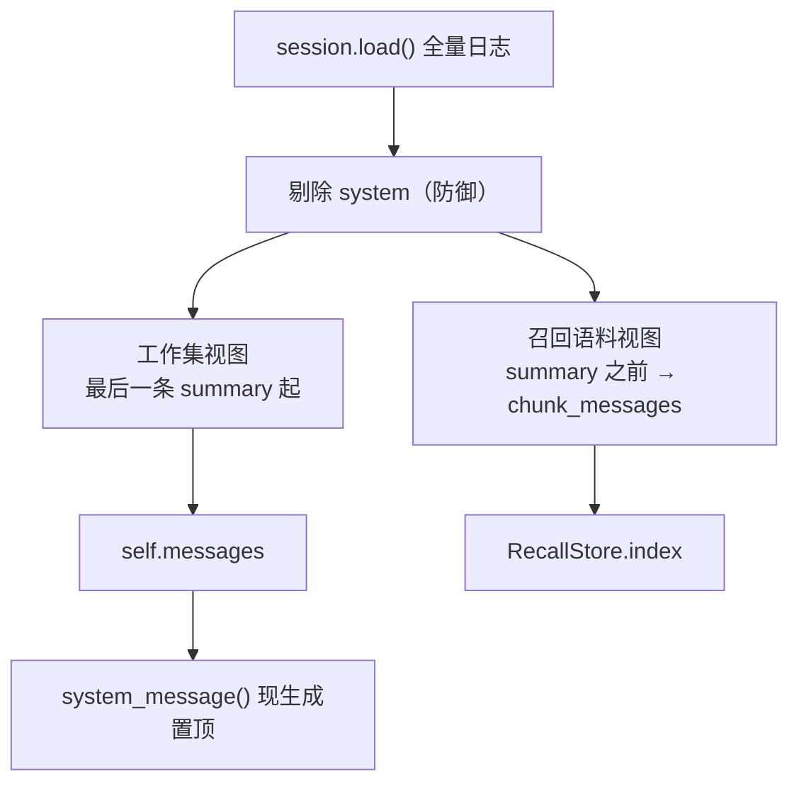

**Shirley 技术方案 · 会话持久化与恢复**

这份文档把 `plan.md` 里那句"聊到一半 AI 模型挂了，我不敢关闭窗口"落地成方案。
它承接 `recall.md`：那份文档把召回库的持久化留了空接口，本文档补上——
但结论是 **recall 不需要自己的持久化层**，它由会话日志派生。

**范围声明**：本轮只定 SDK 侧契约与恢复语义。具体存储后端（SQLite / JSONL / …）
由应用层实现，SDK 不关心。持久化的是**原始 Message 全量日志**，
**不持久化 chunk、不持久化 BM25 索引、不持久化 system 提示词**。

---

**一、核心决策（先定调）**

**决策 1：持久化的是原始 Message，不是召回数据。**

这是本文档最重要的一条，也是它和 `recall.md` "持久化层留空"那句的关系所在：

- `recall.md` 说召回库"将来在 `flush` / `load` 的位置扩展"——方向没错，
  但**扩展点不在召回库，在会话日志**。
- recall 的语料（被压缩掉的对话段）**本来就是消息历史的派生视图**，
  不是独立数据源。持久化原始 Message，恢复时重新派生即可。
- 因此 **recall 不落盘**：`RecallStore` 不持有 `RecallBackend`，
  chunk 与 `Bm25Index` 都是内存里的派生结构。

推论：**一个数据源（日志），两个视图（工作集 / 召回语料），天然一致。**
不存在"日志和召回库对不上"的事务问题——因为只有一份数据。

**决策 2：索引不持久化，恢复时重建。**

`Bm25Index` 是 `Chunk` 的**纯函数**（`add` 是确定性的 tokenize + 计数），
同样输入必得同样输出。持久化索引：

- 省不掉内存驻留——BM25 查询必须在内存里算（遍历 postings、算 idf、排序）；
- 省不掉读回 chunk——恢复时总要把原文读回来；
- 只省下一次**确定性、微秒级**的重建；
- 却引入"索引与 chunk 两份数据要同步"的一致性负担，且把存储后端
  绑死成"必须支持倒排查询"（JSONL 直接做不到）。

**结论：落盘的是 chunk 原文（事实），不是索引（派生）。**
将来要提升检索质量，换的是 `Retriever` 实现（embedding / FTS5），
不是把 BM25 的倒排结构冻进数据库。`Retriever` trait 已经为这个留了口子。

**决策 3：system 提示词不入日志，恢复时重新生成。**

`system_prompt` 可能是函数形式，按 `SystemPromptContext`（工作目录）动态解析，
内容会随 `Agent.md`、工作目录变化。压缩重建时就是这么做的
（`compress_context` 里 `system_message()` 现取一条置顶，不从旧消息复制）。
**恢复必须复用同一套规则**：日志里不含 system，`Agent::new` 时现生成。

**决策 4：日志只追加；rewind 只截尾。**

持久化日志是 append-only 的（正常轮次、压缩、都走追加）。唯一例外是 rewind——
它**只作用于最后一条用户消息**（应用层 `/rewind` 从"任选历史某条"收窄为"只回退最新一条"）。
因为是"只动尾巴"，所以 rewind = `messages` 截尾 + 日志同步截尾，**不存在中间空洞**。

> 为什么不做"任意位置 rewind + 前缀游标"：一旦允许在中间 rewind 后重发，
> 日志里会出现"废弃分支 → 新分支"的洞，前缀游标无法表达，恢复会错位。
> 只截尾把这个复杂度整个消掉了。若将来真要审计废弃分支，得上操作日志
> （`Append` / `RewindTo` 序列），复杂度高一个量级，现在不需要。

**决策 5：`messages` 与 `session` 的真相源优先级——构造时由 messages 裁决。**

- `messages` 非空 → **以它为准，重置 session 到 messages 的样子**；
- `messages` 为空 → 从 `session.load()` 恢复。

若不定死这条，attach 一个已有内容的 session 时会出现"幽灵消息"：
session 有旧尾巴、messages 是真相，挂载后追加就分叉，下次冷启动幽灵复活。
"messages 为准"就等于"挂载那一刻 session 必须被重置成 messages 的样子"。

---

**二、SDK 对外契约**

**2.1 `SessionStore` trait**

```rust
// crates/shirley-agent-sdk/src/session/mod.rs
pub trait SessionStore: Send + Sync {
    /// 追加一条消息到日志尾部。压缩产生的 ContextSummary 也走这里。
    fn append(&self, message: &Message) -> Result<(), SessionError>;

    /// 读取全量日志（只读、顺序）。
    fn load(&self) -> Result<Vec<Message>, SessionError>;

    /// 截断到前 len 条（rewind 用；只截尾）。
    fn truncate(&self, len: usize) -> Result<(), SessionError>;
}
```

三个方法对应三种操作，**恰好是架构里的全部写入语义**：追加（正常轮次 + 压缩）、
读回（恢复）、截尾（rewind）。**故意没有** `delete` / `update` / `search`——用不到。

**设计要点**：

- **接口收 `&Message`，不收 `&[Message]`，更不收 raw JSON。**
  存的是 SDK 语义类型，换协议（OpenAI / Anthropic）不动存储层；
  单条追加天然对齐"一轮一轮落库"。
- **同步签名。** `Agent::new` 是同步的，恢复发生在构造时，同步接口让
  `Agent::new` 不必变异步。存储后端若是异步驱动，由应用层内部消化
  （同步驱动如 `rusqlite` 最省事）。**契约同步，实现自由。**
- **`SessionError` 留在 `session` 模块**，实现 `SdkError`，
  经 `#[from]` 收进 `AgentError`（沿用 `error.rs` 的统一契约）。

**2.2 错误处理**

`append` 失败 = **中断本轮**，不降级继续。理由：持久化失败还继续跑，
等于假装有存档，比直接报错更危险。`SessionError` 的 `ErrorKind` 默认 `Internal`
（存储 I/O 错误不可重试；若将来区分出可重试的瞬时故障，再细化 kind）。

**2.3 对外暴露**

`lib.rs` 新增：`SessionStore`、`SessionError`。
`InMemoryStore` 视用途决定是否公开（给测试与"不落盘但走同一路径"的兜底）。

---

**三、`Agent` 接线**

**3.1 新增字段与 builder 参数**

```rust
pub struct Agent {
    // ...现有字段...
    session: Option<Arc<dyn SessionStore>>,
}

// builder 新增（可选，不传 = 纯内存，行为与现状完全一致）
#[builder(default)] session: Option<Arc<dyn SessionStore>>,
```

`Option` 是关键：**不传 session 时，现有所有行为不变**（不落盘、不恢复），
保证这个改动对既有调用方零影响。

**3.2 构造时恢复（`Agent::new` 内）**

```
if messages 非空:
    self.messages = messages
    session.truncate(messages.len()) 后按需 append?  ← 见下"重置语义"
else if let Some(store) = session:
    let log = store.load()?
    let log = strip_system(&log)                  // system 不入日志；防御性剔除
    self.messages = rebuild_working_set(log)      // [最后一条 ContextSummary 起]
    self.recall.index(chunk_messages(&before_last_summary(&log)))
```

- `rebuild_working_set` **复用现有 `active_messages()` 的规则**（找最后一条
  `ContextSummary`，只保留它之后的）——恢复和工作集切分是同一套规则，不重复实现。
- `before_last_summary(&log)`：取最后一条 summary **之前**的原始消息。
  多次压缩时，更早的 summary 本身是 `ContextSummary`，`chunk.rs` 已规定
  "ContextSummary 不入库"，所以对这段整体做 `chunk_messages` 会自动跳过它们，
  召回语料 = 全部被压过的原始对话，完整。

**"重置语义"的确切含义**：`messages` 非空时，session 必须被对齐到 `messages`。
最简实现是 `truncate(messages.len())`；但若 session 内容与 messages 可能完全不同
（不是前缀关系），则应用层应清空重写。**契约上只保证"构造后 session 镜像 messages"，
具体由应用层实现决定**。SDK 不假设 session 里原有内容与 messages 有前缀关系。

**3.3 写入时机**

| 事件 | 动作 |
| --- | --- |
| `run_stream` push user message | `session.append(user)` |
| 模型返回 assistant message | `session.append(assistant)` |
| 每个 tool message | `session.append(tool)` |
| 压缩成功、`self.messages` 重建 | `session.append(new_summary)` |
| `rewind_last_user_turn` | `session.truncate(新长度)` |

**压缩那条要点**：压缩是**追加一条 summary**，不是重写日志。
日志形如 `[原始… 旧summary 更原始… 新summary]` 全都留着，
恢复时 `active_messages` 自然只认最后一条 summary。**与 append-only 自洽。**

**风险点（`Agent.md` 记过的真实 panic）**：`start_index` 那个
`range start index 10 out of range`。恢复 + 追加 + 压缩三者都动 `self.messages`。
**所有对 `self.messages` 的变更必须收敛成"带 session 同步的私有方法"**，
不让写入点散落——否则下次重建 `messages` 时 `start_index` 又失效。

**3.4 `rewind` 清理**

```rust
// 删除：允许任意位置回退，超出"只截尾"语义
pub fn rewind(&mut self, len: usize);

// 保留并增强：回退最后一轮 user，同步截 session
pub fn rewind_last_user_turn(&mut self) -> Option<String>;
```

删掉 `rewind(len)` 后，**"日志怎么截"只剩一个入口**，不会有两个方法各自截日志、
语义打架。

---

**四、数据流**

**4.1 正常运行（追加）**



**4.2 压缩（追加 summary，不重写）**



**4.3 恢复（一个数据源，两个视图）**



**4.4 落盘结构（应用层视角）**

```
日志文件 / 表（只追加）:
  ├── Message::User        { content }
  ├── Message::Assistant   { content?, reasoning_content?, tool_calls }
  ├── Message::Tool        { tool_call_id, content? }
  ├── Message::ContextSummary { content }   ← 压缩产物，也追加
  └── (无 System)                            ← system 恢复时现生成

内存派生（不落盘）:
  ├── self.messages   = [system] + [最后summary起]
  └── RecallStore     = chunk_messages(最后summary之前) + Bm25Index
```

---

**五、边界与不变量**

1. **日志不含 system。** 恢复时由 `system_message()` 现生成置顶，反映最新工作目录 /
   `Agent.md`。与压缩重建同一套规则。
2. **日志只追加，唯一例外是 rewind 截尾。** 不存在中间空洞。
3. **`ContextSummary` 是日志里的一等消息**，压缩只追加不重写。
4. **recall 完全由日志派生**，不落盘，`RecallStore` 不持 `RecallBackend`。
5. **索引是 chunk 的纯函数**，恢复时重建，不落盘。
6. **构造后 session 镜像 messages**；`messages` 空则从 session 恢复，
   非空则重置 session。二者只能有一个是真相。
7. **`self.messages` 的每次变更都同步 session**，写入收敛到私有方法。

---

**六、与既有文档的关系**

- **`recall.md`**：那份说"持久化层留空接口"。本文档给出结论——
  扩展点不在召回库，在会话日志；recall 由日志派生。`Retriever` trait 保持不变，
  仍是"换检索算法"的扩展点。
- **`compaction.md`**：压缩的 `<compacted_range>` 钩子、"恢复路径二分"
  依然成立。本文档补充：压缩后的 summary 要进日志，否则恢复时工作集缺一截。
- **`roadmap.md`**：把"会话持久化与恢复"从 P2 提升的依据——它是长任务的地基
  （`plan.md`：模型挂了不敢关窗口），且是 rewind 突破"压缩后不可回溯"的前提。
- **`architecture.md`**：表格里"会话持久化 | `runtime` + 应用层 | `Agent` 不落盘 | 未做"
  一行更新为：`session` 模块（trait）+ 应用层（实现）。

---

**七、落地顺序（均已落地）**

1. ~~**`session` 模块**：`SessionStore` + `SessionError` + `InMemoryStore`~~
   ——已落地（`crates/shirley-agent-sdk/src/session/mod.rs`，对外经 `lib.rs` 导出）。
2. ~~**`Agent` 接线**：字段 + builder + 构造时"messages 空则 load" + 各写入点收敛~~
   ——已落地（`record()` 统一"push + append"；压缩走 `session.append(summary)`；
   `build()` 因此返回 `Result`，调用方用 `?` / `unwrap`）。
3. ~~**`rewind` 清理**：删 `rewind(len)`，`rewind_last_user_turn` 同步截 session~~
   ——已落地（只留 `rewind_last_user_turn`；`session_len_for` 换算掉置顶的 system）。
4. ~~**恢复时 recall 派生**：`chunk_messages` 灌回 `self.recall`~~
   ——已落地（构造时按最后一条 summary 切分）。

**应用层后端**：`src/session.rs` 的 `JsonlSessionStore` 是第一个真实
`SessionStore` 实现——每行一条 `Message` 落成 JSONL。
`main.rs` 把它包成 `Arc<dyn SessionStore>` 经 `.session(...)` 挂给 `Agent`，
会话因此**跨进程重启可见**（恢复在 `Agent::new` 内自动发生）。
`truncate` 先写临时文件再原子替换、重开追加句柄；内部 `rewrite_locked`
必须在已持锁下调用，否则非重入锁死锁。

**验收口径**：

- 不传 session 时，全部现有测试与行为不变；
- 传 session、跑若干轮、重启（新建 Agent 复用同一 store），
  `messages` 与重启前一致（system 除外，system 应反映最新上下文）；
- 压缩后重启，AI 仍能 recall 到压缩前的内容（语料由日志重建）；
- rewind 后重启，被丢弃的消息**不复活**（日志同步截尾）；
- 恢复出的 system 是**当前**工作目录 / `Agent.md`，不是旧的。

---

**八、多会话切换（`/session`）**

前面七节解决的是"一份会话如何持久化与恢复"。本节解决"如何拥有并切换多份会话"。

**决策 1：一份会话 = 一份独立日志，目录即索引。**

单文件 `<root>/.shirley/session.jsonl` 升级为目录 `<root>/.shirley/sessions/<name>.jsonl`，
每份会话仍是一份完整的 JSONL 日志（复用 `JsonlSessionStore`，语义不变）。
名字默认取创建时间戳（`YYYYMMDD-HHMMSS`），**目录扫描即"列出会话"**——
不需要额外的索引文件，也不会出现"索引与日志对不上"的一致性问题（延续决策 1 的单一数据源）。

**决策 2：切换是 SDK 的接缝，不是应用的 hack。**

`Agent::switch_session(Arc<dyn SessionStore>)` 是唯一新增的 SDK 对外方法，
与 `/model` 的 `set_model` 对称：模型配置、系统提示词、工作目录、工具、压缩指令
**原样保留**，只替换"当前会话"这一件事。语义与 `Agent::new` 的恢复路径**共用同一套规则**
（`restore_from_session`）：清空内存工作集与召回库 → 从新日志重建 → 按当前上下文
现生成 system 置顶。因此"切换出来的工作集"与"冷启动恢复出来的工作集"必然一致。

配套：`RecallStore::clear()`——切换时必须清空召回库，否则旧会话的 chunk 会污染
新会话的检索（召回语料是会话的派生视图，换会话即换语料）。

**决策 3：会话目录（`SessionCatalog`）收敛"会话从哪来"，与 `ModelCatalog` 对称。**

`src/session.rs` 定义 `SessionCatalog` trait（`list` / `open` / `create` / `latest` / `entry`）
与本地实现 `FileSessionCatalog`。`/session` 指令与选择器 UI 只依赖接口，
将来若要换成远端 / 数据库后端，UI 不用改。

**决策 4：启动恢复"最近修改"的会话，兼容旧单文件日志。**

`main.rs` 启动时打开目录里最近修改的会话；一份都没有就新建一个。
若发现旧版单文件 `<root>/.shirley/session.jsonl` 且目录尚空，则把它收编为
`legacy` 会话（`adopt_legacy`），保证升级不丢历史。

**决策 5：选择器把"切换"与"新建"合并成一个面板。**

`/session` 打开模态选择器（与 `/model` 同款），列表首项固定是「＋ 新建会话」哨兵
（`name` 为空串），其余为真实会话，每项第二行显示首条用户消息预览（认得出会话）。
确认时按哨兵分流到 `create` 或 `open`；确认后重建界面条目（`rebuild_items_from_agent`）
并重置会话绑定的统计（usage / 上下文占用）。

**验收口径**：

- 切换会话后，工作集与召回语料都只反映新会话；旧会话内容不串入；
- 切换后后续轮次的 `append` 落到新日志，旧日志不被改动；
- 切换出的工作集与"直接冷启动到该会话"完全一致（共用恢复规则）；
- 旧单文件日志在首次启动时被收编，历史不丢。
