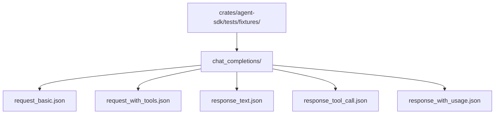

**Shirley 技术方案 · 测试与基准（P1）**

**一、现状**

全仓库 3 个测试，全部在 `read` 工具。SDK 侧 0 测试。而 SDK 里最该测的恰恰是"语义微妙、改错会静默出错"的地方：

- `Usage` 的 `Option` 语义（"未上报" ≠ 0）
- `Usage::Add` 的"保留已知一侧"合并逻辑
- `cache_hit_rate` 的 `None` 分支
- `active_messages` 的 summary 切片
- 压缩阈值的整数比较

这些一旦被改坏，UI 上的数字会安静地变错，不会报错。

**二、测试分层**

| 层 | 测什么 | 工具 |
| --- | --- | --- |
| 单元 | Usage、Message 编解码、参数 schema、宏展开 | `#[test]` / `trybuild` |
| 契约 | 协议 codec 的请求/响应转换 | 固定 JSON 快照 |
| 集成 | ReAct 循环、压缩、取消、重试 | 假模型服务 |
| 基准 | 缓存命中率 | 真实 API + 阈值 |

**三、单元测试（优先）**

**3.1 `Usage` 语义**

这是最该先写的一组，因为它承载了作者刻意的设计决策：

```rust
#[test]
fn adding_unreported_cache_does_not_become_zero() {
    let a = Usage { input_tokens: 100, cached_input_tokens: None, ..Default::default() };
    let b = Usage { input_tokens: 100, cached_input_tokens: Some(50), ..Default::default() };
    let sum = a + b;
    // 不能变成 Some(50) 之外的任何东西；且不能因为 a 是 None 就丢掉 b
    assert_eq!(sum.cached_input_tokens, Some(50));
    assert_eq!(sum.input_tokens, 200);
}

#[test]
fn cache_hit_rate_is_none_when_unreported() {
    let usage = Usage { input_tokens: 100, cached_input_tokens: None, ..Default::default() };
    assert_eq!(usage.cache_hit_rate(), None);
}

#[test]
fn cache_hit_rate_is_none_when_reported_zero_input() {
    let usage = Usage {
        input_tokens: 0,
        cached_input_tokens: Some(0),
        cache_reported_input_tokens: Some(0),
        ..Default::default()
    };
    assert_eq!(usage.cache_hit_rate(), None); // 分母为 0 不返回 NaN
}
```

**3.2 `active_messages` 切片**

压缩是"不可逆"的，`start_index` 语义容易改坏：

```rust
#[test]
fn active_messages_keeps_leading_system_and_latest_summary() {
    // System, User, Assistant, ContextSummary, User, Assistant
    // 期望：System + ContextSummary 及其之后
}

#[test]
fn active_messages_uses_last_summary_when_multiple() {
    // 两个 ContextSummary，只从最后一个开始
}
```

**3.3 压缩阈值**

`should_schedule_compression` 用整数比较避免浮点问题，要守住边界：

```rust
#[test]
fn compression_triggers_at_exactly_eighty_percent() {
    // used * 100 >= limit * 80
    // limit=1000, used=800 -> true
    // limit=1000, used=799 -> false
}
```

**3.4 宏展开**

用 `trybuild` 锁定宏的编译期约束（`Agent.md` 里列的踩坑点）：

- 缺少 `#[param(description)]` → 编译失败
- 参数解构 → 编译失败
- 函数名与 mod 不同层 → 编译失败

同时测 `Arguments` 的 `deny_unknown_fields` 是否生效。

**四、契约测试**

协议 codec 的输入输出用固定 JSON 快照，避免每次重构都靠肉眼看：



用 `insta` 或手写快照对比。重点覆盖 `Usage` 的 `prompt_tokens_details.cached_tokens` 缺失/存在两种情况。

**五、集成测试：假模型服务**

需要一个可控的假模型，才能测循环、重试、取消：

```rust
// crates/agent-sdk/tests/support/mock_server.rs
pub struct MockModel {
    // 按顺序返回预设响应
    responses: Vec<ModelResponse>,
    // 记录收到的请求，用于断言 prefix 稳定性
    received: Arc<Mutex<Vec<Value>>>,
}
```

可以基于 `wiremock` 或最小 `axum` 实现。要覆盖的场景：

1. 正常一轮：user → assistant（无工具）→ Finished
2. 工具调用：assistant(tool_calls) → tool → assistant → Finished
3. 多工具并发：验证 `FuturesUnordered` 的结果顺序与 `tool_call_id` 对应
4. 无限工具循环：验证 `max_steps` 生效（见 `runtime-hardening.md`）
5. 429 后成功：验证重试
6. 压缩失败：验证降级不中断
7. 取消：验证 `StopReason::Cancelled` 且历史完整

**六、缓存命中率基准**

`plan.md` 明确要求过这件事，一直没做：

> 其实，就是用一些简单的case，然后去跑一些 api 接口测试一下缓存命中多少。设置一个阈值。

方案：一个独立的、默认 `#[ignore]` 的集成测试，读环境变量拿真实 key，跑固定序列：

1. 第一轮：长 system prompt + 工具定义 → 记录 `cached_input_tokens`（预期接近 0）
2. 第二轮：同一前缀 + 新 user 消息 → 记录命中率（预期高）
3. 断言第二轮命中率 > 阈值（建议先测出实际值再定，比如 0.5）

关键：**任何会改动请求前缀的代码都要重跑这个基准**。`Agent.md` 第七节第一条就是"别破坏 prefix 稳定性"，这个基准是那条规则的执行手段。

**七、性能**

流式落地后，`MessageCache` 每帧重建会变成瓶颈（现在是每来一条消息整体置 `None`，长会话 O(n²)）。需要：

- 改成增量追加：新消息只渲染新增部分，追加到 `lines` 与 `row_offsets`。
- `visible_lines` 去掉每帧 `.to_vec()` 克隆。
- 顺带修 `row_offsets` 的换行估算与 ratatui `Wrap` 不一致的问题（见 `roadmap.md` 提到的滚动偏移）。

**八、CI**

新增 `.github/workflows/ci.yml`：

```yaml
- cargo fmt --check
- cargo clippy --all-targets -- -D warnings
- cargo test --all
```

当前 36 条 clippy 警告（`agent-sdk` 32 条 + 应用层 4 条）要么修掉，要么显式 `allow` 并写明原因。`-D warnings` 是让"顺手能修的"不再堆积的唯一办法。

**九、验收**

1. `cargo test --all` 覆盖 Usage 语义、压缩切片、阈值边界。
2. 假模型集成测试覆盖 7 个场景。
3. 缓存命中率基准有可执行脚本与阈值。
4. CI 绿灯，`clippy -D warnings` 通过。
