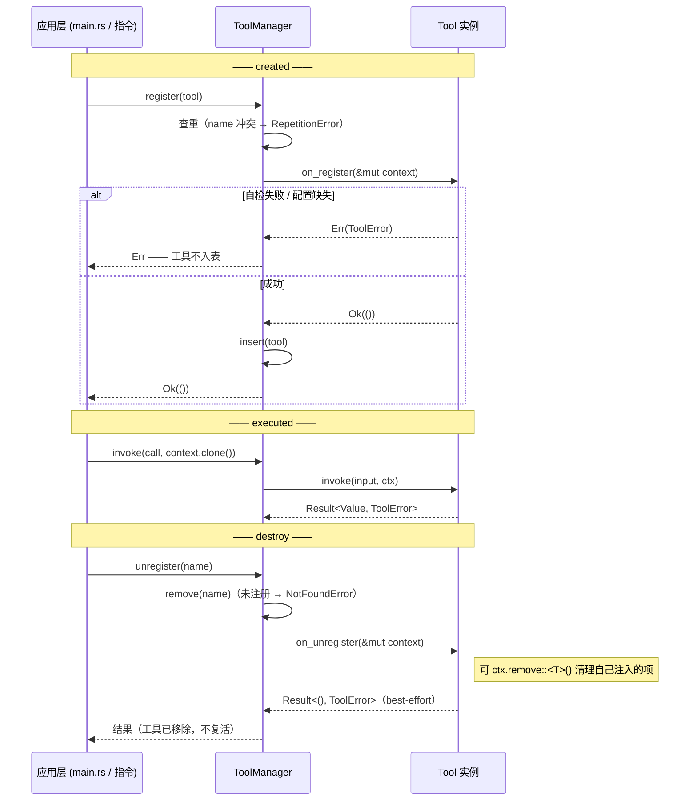

**Shirley 技术方案 · 工具生命周期（Tool Lifecycle）**

> **状态：已实现。** trait 侧（`on_register` / `on_unregister` / `ToolContext::remove` /
> `ToolManager::unregister` / `Agent::unregister_tool`）与宏侧（`#[tool(on_register = ...,
> on_unregister = ...)]`）均已落地，`web_search` 已迁到该形态。宏侧细节见
> `docs/tool-macro.md`；回归测试见 `crates/shirley-agent-sdk/tests/tool_lifecycle.rs`。
>
> 文档正文保留了方案期的推理过程（含被否掉的形态），**以下方"实现落地"一节的措辞为准**。

**一、这份文档要解决什么**

`ToolContext` 曾是**应用层手动创建、和 `ToolManager` 并列**的独立 builder 参数。它带来三个具体问题：

1. **职责错位**。`ToolContext` 在语义上完全依附于工具，却由应用层独立构造、独立传入，和 `tools` 并列。它没有独立存在的理由。
2. **注册与注入会漂移**。注册工具（`tool_manager.register`）和注入依赖（`tool_context.with(state)`）是**两个手动步骤**。只做前者、忘了后者，编译不报错，直到运行时 `ctx.get` 返回 `None` 才炸。
3. **没有注册期自检**。配置缺失 / 错误只能等到第一次调用才暴露。

应用层现状（`src/main.rs`）：

```rust
let mut tool_context = ToolContext::new();
match tools::WebSearchState::from_env() {
    Ok(Some(state)) => {
        let _ = tool_manager.register(tools::web_search_tool::tool());  // 注册
        tool_context = tool_context.with(state);                        // 注入（另一步）
    }
    Ok(None) => {}
    Err(error) => eprintln!("[web_search] 未启用：{error}"),
}
// ...
.tools(tool_manager)
.tool_context(tool_context)   // ← 又一个独立顶层参数
```

用户诉求（原话）：希望有"工具的生命周期"——`created` / `executed` / `destroy` 分别在注册、执行、注销时调用；且 `ToolManager` 应有**移除工具**的能力，从而让 `destroy` 有真实触发路径，并在移除时**清理 `ToolContext`**。

---

**二、阶段映射**

| 用户所述 | 实际对应 | 现状 / 本方案 |
| --- | --- | --- |
| **created** | 注册时 | ❌ 新增 `on_register` |
| **executed** | **就是 `invoke`** | ✅ 已存在，无需新增 |
| **destroy** | 注销时 | ❌ 新增 `on_unregister` + `ToolManager::unregister` |

- `executed` 不是新东西：`Tool::invoke(&self, input, ctx)` 本身就是"执行"这个生命周期事件；执行前后的可观测性已由 `AgentEvent::ToolStarted` / `ToolFinished` 提供。**再叠一层 `on_execute` 是重复。**
- `destroy` **本方案要做**。上一版曾以"无调用方"为由不做，这个理由不成立——**可以造调用方**：`ToolManager::unregister` 就是它的触发路径。钩子与触发路径**同时落地**，见第四、五节。

所以本方案新增**两个**钩子：`on_register`（created）、`on_unregister`（destroy）。

---

**三、设计目标与非目标**

**目标**

1. `ToolContext` 的所有权从应用层移入 SDK（`ToolManager` 持有）。
2. 让"注册工具"和"注入依赖 / 自检配置"合成**同一步**，消除漂移。
3. 提供**移除工具**的能力（`unregister`），并在移除时触发清理钩子、清理 `ToolContext`。
4. 无状态工具**零改动**（向后兼容）。

**非目标**

1. 不做依赖注入容器 / typed provider registry（理由见第七节）。
2. ~~不改 `#[tool]` 宏~~ → **改为：给函数宏加可选伴生钩子**。默认方法让无状态工具零改动，
   但有状态工具（`web_search`）需要宏能把钩子 wire 进生成的 `impl Tool`——否则它只能退回
   "手写 `impl Tool`"，而用户的核心约束是"宏是唯一入口，用户不碰工具细节"。见
   `docs/tool-macro.md`。

**一条不可消除的约束**

> SDK 不可能"自己创建" `ToolContext` 的**内容**。

内容（`WebSearchState`、session 句柄、凭据）是**应用层才拥有的具体类型**——读 env、建 HTTP client、拿密钥全是应用侧的事。SDK 保持通用就不能认识这些类型。所以"收到 SDK 内部"只能是：**SDK 拥有容器，应用通过注册期钩子把值放进去**。值是应用给的这一点无法消除，但创建 / 持有 / 分发 / **清理**的责任可以移进 SDK，且能让注册与注入变成同一步。

---

**四、生命周期设计**

**4.1 `ToolContext`：补一个 `remove`（当前缺失）**

现状（`tool/mod.rs`）只有 `new` / `with`（插入）/ `get`。要支持"清理"，必须补 `remove`：

```rust
impl ToolContext {
    /// 移除一份应用数据，返回被移除的值（不存在则 None）。
    /// 内部是 `Arc<HashMap>` + `Arc::make_mut` 写时复制：
    /// 若此刻有在途的工具调用持有旧 clone，`make_mut` 会复制一份，
    /// 在途调用仍看到旧数据（安全，无悬垂）。
    pub fn remove<T: Any + Send + Sync>(&mut self) -> Option<Arc<T>> {
        Arc::make_mut(&mut self.inner)
            .remove(&TypeId::of::<T>())
            .and_then(|value| value.downcast::<T>().ok())
    }
}
```

> **注意（写进文档，避免踩坑）**：`ToolContext` 按 `TypeId` 索引。若两个工具注入了**同一类型**，其中一个注销时 `remove` 会把另一个的数据也清掉。约定：**每个工具用独立的新类型**（newtype）承载自己的状态；共享句柄（形态 B）不要由单个工具在 `on_unregister` 里移除，由应用层显式管理。

**4.2 `Tool` trait：新增两个默认钩子**

```rust
pub trait Tool: Send + Sync {
    fn definition(&self) -> &ToolDefinition;

    /// 执行（= executed）。已有，不改。
    fn invoke(&self, input: serde_json::Value, ctx: ToolContext) -> ToolFuture<'_>;

    /// 注册（= created）。`ToolManager::register` 在查重通过后、插入前调用一次。
    /// 工具在这里 (a) 把共享运行时依赖写进上下文 / 存进 self；
    /// (b) 自检配置，缺失即 `Err` —— 注册失败，工具不入表。
    /// 默认空实现：无状态工具零改动。
    fn on_register(&mut self, _ctx: &mut ToolContext) -> Result<(), ToolError> {
        Ok(())
    }

    /// 注销（= destroy）。`ToolManager::unregister` 在把工具移出表之后调用一次。
    /// 工具在这里释放自己注入的上下文项（`ctx.remove::<T>()`）等。
    /// 默认空实现：无状态工具零改动。
    ///
    /// 语义：**best-effort 清理**。无论返回 `Ok` 还是 `Err`，工具都已从表里移除
    /// （见 4.3 的顺序）；`Err` 只用于告知调用方"清理失败"，不会让工具复活。
    fn on_unregister(&mut self, _ctx: &mut ToolContext) -> Result<(), ToolError> {
        Ok(())
    }
}
```

**4.3 `ToolManager`：持有 `ToolContext` + 支持移除**

```rust
pub struct ToolManager {
    tools: HashMap<ToolName, Box<dyn Tool>>,
    context: ToolContext,          // ← 从 Agent 挪进来
}

impl ToolManager {
    pub fn register(&mut self, mut tool: impl Tool + 'static) -> Result<(), ToolError> {
        let name = tool.definition().name.clone();
        if self.tools.contains_key(&name) {
            return Err(ToolError::RepetitionError(format!(
                "tool already registered: {name}"
            )));
        }
        tool.on_register(&mut self.context)?;   // created：失败即不入表
        self.tools.insert(name, Box::new(tool));
        Ok(())
    }

    /// 移除一个工具：先移出表，再触发 `on_unregister`（可清理 `ToolContext`）。
    /// 未注册的名字返回 `NotFoundError`。
    pub fn unregister(&mut self, name: &str) -> Result<(), ToolError> {
        let mut tool = self
            .tools
            .remove(name)
            .ok_or_else(|| ToolError::NotFoundError(name.to_string()))?;

        // 顺序：已移出表 → 再回调。即使回调报错，工具也不会复活。
        tool.on_unregister(&mut self.context)
    }

    /// runtime 取上下文用（替代原 `Agent.tool_context` 字段）。
    pub fn context(&self) -> &ToolContext { &self.context }
    pub fn context_mut(&mut self) -> &mut ToolContext { &mut self.context }
}
```

**关键顺序**

- `register`：查重 → `on_register` → **成功才 `insert`**。初始化失败不留半注册工具。
- `unregister`：**先 `remove`（移出表）→ 再 `on_unregister`**。清理失败不会留下"已调用 destroy 但仍在表里"的错乱状态。

**4.4 值怎么进钩子：两条路，分场景**

钩子是 `&mut self`，它要么**自己带状态**，要么**由应用在注册时喂**。

> **落地结论**：`web_search` 选了**形态 B**（保留 `#[tool]` 函数宏 + 注册钩子写 `ctx`），
> 而不是形态 A 的手写 `impl Tool`——因为"用户不碰工具细节"是硬约束（见 `docs/tool-macro.md`）。
> 形态 A 仍适用于 `recall`（它需要 `impl Tool` 来持有 `Arc<RecallStore>`，且是 SDK 内部工具）。
> 下面两条形态都保留，作为"值怎么进钩子"的通用说明。

- **形态 A：工具私有状态 → 工具自己持有（`RecallTool` 的既有先例）**

  `RecallTool::new(store)` 就是工具直接持有 `Arc<RecallStore>`、无视 `ToolContext`——**这个形态已存在且干净**。`web_search` 适合走这条：

  ```rust
  pub struct WebSearchTool { state: WebSearchState, definition: ToolDefinition }

  impl Tool for WebSearchTool {
      fn on_register(&mut self, _ctx: &mut ToolContext) -> Result<(), ToolError> {
          self.state.validate()?;   // 注册期自检，配置坏了当场拒绝
          Ok(())
      }
      fn invoke(&self, input: serde_json::Value, _ctx: ToolContext) -> ToolFuture<'_> {
          let state = self.state.clone();   // 直接读 self，不依赖 ctx
          Box::pin(async move { /* ... */ })
      }
      // 状态随 self drop，无需 on_unregister
  }
  ```

  应用侧变成"注册即自带依赖"：

  ```rust
  let mut tools = ToolManager::new();
  tools.register(tools::bash_tool::tool())?;
  tools.register(tools::read_file_tool::tool())?;
  match tools::WebSearchTool::from_env() {
      Ok(Some(tool)) => { tools.register(tool)?; }   // 注册即自带依赖，无法漂移
      Ok(None) => {}                                  // 未配置，静默跳过
      Err(e)  => eprintln!("[web_search] 未启用：{e}"),
  }
  ```

- **形态 B：跨工具共享的运行时句柄 → 钩子写进 `ToolContext`**

  比如多个工具都要 `Arc<Mutex<Session>>`。应用在注册时喂一次：

  ```rust
  tools.register(BumpTool::new())?;
  tools.context_mut().with(session_handle);   // 共享句柄，只放一次
  ```

  这类共享句柄由**应用层**决定生命周期，**不要在单个工具的 `on_unregister` 里 `remove`**（会误伤其它工具）。

---

**五、生命周期时序**



---

**六、`unregister` 的调用方从哪来**

上一版以"无调用方"否掉 `destroy`。本方案通过**同时**提供 `unregister` 造出调用方。但要诚实说明"调用方"分两层：

1. **SDK 层**：`ToolManager::unregister` 是公开 API，`Agent` 应暴露对称的接缝（与 `set_model` / `set_provider` / `unregister_tool` 同风格）：

   ```rust
   impl Agent {
       /// 移除一个已注册的工具。与 register 对称的运行时接缝。
       pub fn unregister_tool(&mut self, name: &str) -> Result<(), AgentError> {
           self.tools.unregister(name).map_err(Into::into)
       }
   }
   ```

2. **应用层（待定，见第九节决策 3）**：目前没有 UI 指令调用它。可选的自然调用方：
   - `/tools` 指令列出 / 开关工具（运行期动态启停，如临时关掉 `web_search`）；
   - 切换模型 / provider 时，某些工具不再适用。

   **若最终没有应用层调用方**，`unregister` 仍作为 SDK 的**设计接缝**存在（有单测覆盖），但应在文档里标注"暂无应用层消费者"，避免下一个 Agent 误以为它是死代码。

---

**七、被否掉的方案**

| 方案 | 为什么不做 |
| --- | --- |
| **依赖注入容器 / typed provider registry**（工具声明依赖类型、SDK 从注册表解析） | 把 `ToolContext` 升级成 DI 框架，正是 `plan.md` 警告的"预判所有需求"。当前只有 `web_search` 一个消费者，不值得。 |
| **`on_execute` 钩子** | `invoke` 已是执行事件；`AgentEvent::ToolStarted/ToolFinished` 已提供可观测性。重复。 |
| **自动清理上下文**（manager 记录每个工具注入了哪些 TypeId，注销时自动移除） | manager 拿不到"工具注入了什么"的信息，只能靠约定。显式 `ctx.remove` 更简单，且不引入追踪状态。 |
| **`on_unregister` 用异步** | 当前清理是同步的（移除 map 项 / drop 句柄）。`Drop` 本身不能 `await`。将来若需异步 teardown，再单独设计，不提前上 async。 |
| ~~**`#[tool]` 宏支持 `#[tool(on_register = ...)]`**~~ | **已采纳。** 当时的理由（"无消费者"）被推翻：`web_search` 就是消费者，且"用户不碰工具细节"要求宏能接线钩子。落地为可选属性 `on_register` / `on_unregister`，见 `docs/tool-macro.md`。 |

---

**八、改动面清单**

| 项 | 影响 | 破坏性 |
| --- | --- | --- |
| `ToolContext` | 新增 `remove::<T>()` | 否 |
| `Tool` trait | 加**默认** `on_register` / `on_unregister`；无状态工具零改动 | 否 |
| `ToolManager` | 加 `context` 字段 + `context()` / `context_mut()` / `unregister()`；`register` 调钩子 | 否 |
| `Agent` | 删 `tool_context` 字段与 builder 参数；新增 `unregister_tool` 接缝 | **是**（`0.0.x` 语义） |
| `main.rs` | 唯一调用方，删 `.tool_context(...)` 与装配；`web_search` 注册钩子接管状态注入 | 否 |
| `#[tool]` 宏 | 加**可选**属性 `on_register` / `on_unregister`（引用伴生函数）；不写即空实现 | 否 |
| 文档 | `Agent.md` 工具系统章节、`docs/web-search.md` 第二节、`docs/README.md` 索引、`docs/tool-macro.md` | 否 |

---

**九、待 review 的决策点**

1. **`web_search` 走哪条**：~~A / B 待定~~ → **已定：B**（保留 `#[tool]` 宏 + `on_register` 写
   `ctx`）。原因：宏是唯一入口、用户不碰工具细节。

2. **`Agent::builder().tool_context()`**：~~A / B 待定~~ → **已定：A（直接删）**。
   `ToolContext` 归 `ToolManager` 所有，`Agent` 不再持有。

3. **`unregister` 的应用层调用方**：~~A / B 待定~~ → **已定：B**。先只做 SDK 接缝
   （`ToolManager::unregister` + `Agent::unregister_tool`）+ 单测，**暂无应用层消费者**。

4. **`on_unregister` 的失败语义**：~~待确认~~ → **已定：best-effort，工具不复活**。`unregister`
   先 `remove` 再回调，`Err` 只用于告知清理失败。

---

**十、与既有文档的关系**

- 本方案是 `docs/sdk-gaps.md` gap-1（工具上下文注入）的**续作**：gap-1 让工具"能拿到"上下文，本方案解决"上下文由谁持有、何时初始化、何时清理"。
- 边界判定仍遵循 `Agent.md` 第八节第 4 条：`ToolContext` / `on_register` / `on_unregister` 是**通用机制**，属 SDK；具体工具（`web_search`）及其状态属**应用层**。
